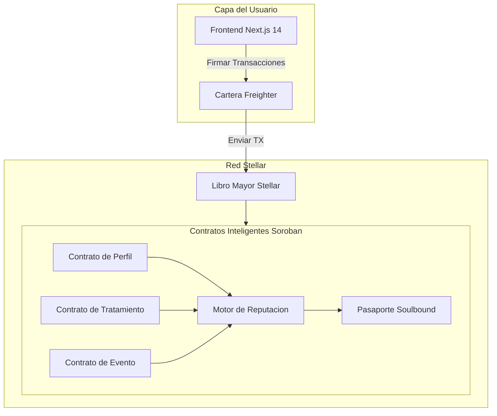

<p align="center">
  
</p>

<h1 align="center">CronoCapilar — Whitepaper</h1>
<h3 align="center">Proof of Care: Un Protocolo de Reputacion Descentralizada para el Cuidado Capilar Natural</h3>

<p align="center">
  <strong>Version 1.0 | Marzo 2026</strong><br/>
  Angela Salles — <a href="https://ang3la.xyz">Ang3la.xyz</a>
</p>

---

## Indice

1. [Resumen Ejecutivo](#1-resumen-ejecutivo)
2. [Analisis de Mercado](#2-analisis-de-mercado)
3. [Declaracion del Problema](#3-declaracion-del-problema)
4. [CronoCapilar: La Solucion](#4-cronocapilar-la-solucion)
5. [Por que Stellar](#5-por-que-stellar)
6. [Arquitectura del Protocolo](#6-arquitectura-del-protocolo)
7. [Protocolo Proof of Care](#7-protocolo-proof-of-care)
8. [Pasaporte Soulbound (SBT)](#8-pasaporte-soulbound-sbt)
9. [Motor de Reputacion](#9-motor-de-reputacion)
10. [Capa Comunitaria y Social](#10-capa-comunitaria-y-social)
11. [Modelo de Ingresos](#11-modelo-de-ingresos)
12. [Onboarding: Cuidado Primero, Cripto Nunca](#12-onboarding-cuidado-primero-cripto-nunca)
13. [Analisis Competitivo](#13-analisis-competitivo)
14. [Gobernanza](#14-gobernanza)
15. [Hoja de Ruta](#15-hoja-de-ruta)
16. [Equipo](#16-equipo)
17. [Referencias](#17-referencias)

---

## 1. Resumen Ejecutivo

El mercado global de cuidados capilares supera los US$90 mil millones anuales, pero la experiencia para consumidores de cabello natural sigue siendo fragmentada, opaca e impulsada por fuentes poco confiables. Personas con cabello rizado, coily y texturizado navegan un laberinto de productos, rutinas y consejos contradictorios — sin forma de verificar que realmente funciona, para quien y durante cuanto tiempo.

**CronoCapilar** es una red social descentralizada construida en [Stellar](https://stellar.org) que transforma rutinas diarias de cuidado capilar en registros verificables on-chain llamados **Proof of Care**. Cada tratamiento, evento e hito se registra permanentemente en la blockchain de Stellar, formando un pasaporte capilar inmutable que pertenece enteramente al usuario.

Este pasaporte alimenta un **Motor de Reputacion** que recompensa el autocuidado consistente con autoridad comunitaria — no por especulacion o tenencia de tokens, sino por accion genuina y sostenida. El resultado es una capa de confianza que beneficia a todos: los usuarios obtienen insights confiables de pares, los profesionales obtienen contexto sobre clientes, y las marcas obtienen inteligencia de mercado autentica.

CronoCapilar es gratuito para todos los usuarios, siempre. Los ingresos se generan a traves de un Marketplace curado, informes de B2B Intelligence y Herramientas Profesionales — tres pilares que monetizan la capa de confianza sin jamas cobrar a las personas que la crean.

---

## 2. Analisis de Mercado

### 2.1 La Industria Global de Cuidados Capilares

El mercado de cuidados capilares es uno de los segmentos mas grandes dentro del cuidado personal, valorado en mas de **US$90 mil millones** globalmente y creciendo de forma consistente ano tras ano. Dentro de este mercado, el segmento de cabello natural y texturizado experimenta un crecimiento acelerado, impulsado por movimientos culturales que celebran la belleza natural, mayor representacion en los medios y un cambio generacional contra el alisado quimico.

Dinamicas clave del mercado:

- **Proliferacion de productos sin orientacion.** Miles de nuevos productos se lanzan anualmente dirigidos al cabello rizado y coily, pero los consumidores no tienen un mecanismo confiable para evaluarlos mas alla de las afirmaciones de marketing y recomendaciones de influencers.
- **Altas tasas de insatisfaccion.** La investigacion realizada para el pitch CronoCapilar Ignite revelo que el **68% de los consumidores de cabello natural** reportan insatisfaccion con sus rutinas de cuidado, citando confusion sobre la programacion de tratamientos y seleccion de productos como principales frustraciones.
- **Desconexion profesional.** Los profesionales del cuidado capilar — estilistas, tricologos y propietarios de salones — operan con datos historicos minimos sobre las rutinas domesticas de sus clientes, llevando a recomendaciones suboptimas.

### 2.2 La Persona: Maria

Durante el desarrollo, CronoCapilar identifico una persona central que representa a millones:

> **Maria** tiene 28 anos y transiciono a cabello natural hace dos anos. Sigue a multiples influencers, ha probado docenas de productos y mantiene un calendario mental de tratamientos de Hidratacion, Nutricion y Reconstruccion. A pesar de su esfuerzo, no sabe si su rutina realmente esta funcionando. No puede compartir su historial con un estilista. No confia en las resenas de productos porque no puede verificar la experiencia real del evaluador. Maria quiere claridad, comunidad y la prueba de que su dedicacion importa.

Maria representa una audiencia masiva y desatendida: personas que se preocupan profundamente por su cabello pero carecen de la infraestructura para cuidarlo de forma efectiva.

### 2.3 La Brecha de Confianza

El ecosistema de cuidado capilar natural sufre de un deficit estructural de confianza:

```
┌──────────────────────────────────────────────────────┐
│                  LA BRECHA DE CONFIANZA                │
├──────────────┬───────────────┬───────────────────────┤
│   Usuarios   │  Profesionales│     Marcas             │
│   ────────   │  ───────────  │     ──────             │
│   Sin hist.  │  Sin contexto │     Sin feedback real  │
│   Sin prueba │  Sin timeline │     Sin datos verif.   │
│   Sin conf.  │  Sin contin.  │     Sin confianza gana.│
└──────────────┴───────────────┴───────────────────────┘
```

Cada participante en el ecosistema — usuarios, profesionales y marcas — sufre por la ausencia de un registro compartido y verificable de cuidado. CronoCapilar llena esta brecha.

---

## 3. Declaracion del Problema

### 3.1 El Ciclo de Frustracion

La experiencia de cuidado capilar natural, para la mayoria de las personas, sigue un ciclo predecible y agotador:

```
  ┌─────────────────────────────────────────────┐
  │           EL CICLO DE FRUSTRACION            │
  │                                               │
  │    Confusion ──► Producto Errado ──► Fallo   │
  │        ▲                              │       │
  │        │                              ▼       │
  │    Sin Registro ◄── Frustracion ◄── $ Perdido│
  │                                               │
  └─────────────────────────────────────────────┘
```

1. **Confusion** — El usuario no sabe si su cabello necesita Hidratacion, Nutricion o Reconstruccion en ese momento.
2. **Producto errado** — Sin datos ni orientacion confiable, selecciona productos basandose en marketing, posts de influencers o prueba y error.
3. **Fallo** — El producto no entrega los resultados esperados porque no era el tratamiento correcto para el estado actual del cabello.
4. **Recursos desperdiciados** — Tiempo y dinero se pierden en productos que nunca fueron adecuados.
5. **Frustracion** — El usuario pierde confianza en su capacidad para manejar su propio cabello.
6. **Sin registro** — Nada fue rastreado, ninguna leccion se preservo, y el ciclo comienza de nuevo.

### 3.2 Causas Raiz

El ciclo de frustracion persiste por cuatro fallas sistemicas:

**Sin memoria persistente.** Las rutinas capilares existen solo en la mente del usuario. No hay sistema para registrar tratamientos, seguir resultados a lo largo del tiempo ni identificar patrones.

**Sin identidad portatil.** Cuando un usuario visita un nuevo profesional, cambia de ciudad o busca consejos en linea, comienza desde cero. No existe un "curriculum capilar" verificable que pueda presentar.

**Sin infraestructura de credibilidad.** En las redes sociales, una persona que nunca toco un acondicionador profundo tiene el mismo alcance de plataforma que alguien con anos de cuidado dedicado. La experiencia no se distingue del rendimiento.

**Sin continuidad profesional.** Estilistas y tricologos dependen enteramente del auto-reporte del cliente — que es incompleto, sesgado e inconsistente. Cada consulta opera en aislamiento.

---

## 4. CronoCapilar: La Solucion

### 4.1 Vision

CronoCapilar no es una app de seguimiento capilar. Es una **red social descentralizada** donde las acciones de autocuidado crean identidad, reputacion y confianza comunitaria — todo anclado a la blockchain de Stellar.

La idea central es simple: **si el cuidado es visible, el cuidado se vuelve valioso.** Cuando alguien puede demostrar — en un libro mayor inmutable — que ha cuidado consistentemente su cabello durante meses o anos, esa prueba se transforma en autoridad. La autoridad crea confianza. La confianza crea comunidad. La comunidad crea valor.

### 4.2 Experiencia Central

La trayectoria del usuario sigue una progresion natural:

```
  Iniciar sesion ──► Crear Perfil Capilar ──► Check-in Diario (H/N/R)
                                                         │
                                                         ▼
                                               Registrar Eventos
                                             (Big Chop, cortes, color)
                                                         │
                                                         ▼
                                             Construir Proof of Care
                                                         │
                                                         ▼
                                             Ganar Reputacion & Badges
                                                         │
                                                         ▼
                                             Participar en Comunidad
                                         (validar, compartir, mentorar)
```

1. **Inicia sesion** en CronoCapilar con tu cuenta (en segundo plano, la app crea o conecta una cartera Stellar compatible, ej. [Freighter](https://www.freighter.app/))
2. **Crea** un perfil capilar on-chain (tipo, longitud, textura, objetivos)
3. **Haz check-in** diario con tratamientos: **H**idratacion, **N**utricion o **R**econstruccion
4. **Registra eventos** — Big Chop, cortes, coloracion, tratamientos de proteina y otros hitos
5. **Construye** una linea de tiempo de Proof of Care — un registro inmutable de toda la trayectoria capilar
6. **Gana** reputacion, badges y evolucion del Pasaporte Soulbound por cuidado sostenido
7. **Participa** en la comunidad — valida pares, comparte insights y construye conocimiento colectivo

### 4.3 Lo Que Lo Hace Diferente

CronoCapilar no esta compitiendo con apps de cuidado capilar. Esta construyendo algo que aun no existe: **una infraestructura de confianza para el cuidado capilar.**

| Apps Tradicionales | CronoCapilar |
|:-------------------|:-------------|
| Datos en servidores de la empresa | Datos en la blockchain de Stellar |
| La plataforma posee los datos | El usuario posee sus datos |
| Reputacion = seguidores | Reputacion = acciones de cuidado verificadas |
| Recomendaciones por algoritmo | Recomendaciones por autoridad comunitaria |
| Sin portabilidad | Pasaporte Soulbound portatil |
| Profesionales excluidos | Profesionales integrados |

---

## 5. Por que Stellar

### 5.1 Alineamiento Filosofico

Stellar fue creada con la mision de inclusion financiera — conectando a las poblaciones no bancarizadas y desatendidas del mundo con la economia global. CronoCapilar comparte este ADN: el cuidado capilar natural afecta desproporcionadamente a comunidades que han sido historicamente marginadas tanto en la belleza como en las finanzas. Construir sobre Stellar significa construir sobre una base disenada para las personas a las que CronoCapilar sirve.

### 5.2 Comparacion Tecnica

| Criterio | Stellar / Soroban | Ethereum / EVM | Solana |
|:---------|:------------------|:----------------|:-------|
| **Costo de transaccion** | < $0,01 | $1–50+ (variable) | < $0,01 |
| **Finalidad** | 3–5 segundos | ~15 segundos (L1) | ~400ms |
| **TPS** | 1.000+ | ~15 (L1) | ~4.000 |
| **Contratos inteligentes** | Soroban (Rust/WASM) | Solidity (EVM) | Rust (BPF) |
| **Anchors & bridges** | Nativo (estandares SEP) | Bridges de terceros | Bridges de terceros |
| **Enfoque en identidad** | Nativo (cuentas, data entries) | Externo (ENS, etc.) | Externo |
| **Alineamiento de mision** | Inclusion financiera | Proposito general | DeFi de alto rendimiento |

### 5.3 Capacidades Stellar Utilizadas

- **Contratos Inteligentes Soroban** — Toda la logica del protocolo (perfiles, tratamientos, reputacion, pasaportes) se ejecuta como contratos Soroban escritos en Rust, compilados a WASM.
- **Cuentas Stellar & Manage Data** — Los perfiles de usuarios aprovechan las entradas de datos nativos de cuentas Stellar para almacenamiento ligero de identidad.
- **Estandares SEP** — La integracion futura con el ecosistema de Anchors de Stellar habilita rampas de entrada/salida fiat para funcionalidad de marketplace.
- **Cartera Stellar (ej. Freighter)** — Usada en segundo plano en las operaciones on-chain; el usuario inicia sesion en la app, no en la cartera.

---

## 6. Arquitectura del Protocolo

### 6.1 Vision General de la Arquitectura



### 6.2 Capa On-chain (Contratos Soroban)

Cinco contratos inteligentes Soroban forman el nucleo on-chain del protocolo:

#### Contrato de Perfil
Almacena la identidad de cuidado capilar del usuario:
- Tipo de cabello (liso, ondulado, rizado, coily — usando escala numerica)
- Categoria de longitud
- Textura y porosidad del cabello
- Timestamp de creacion del perfil
- Propietario (clave publica Stellar)

#### Contrato de Tratamiento
Registra cada accion diaria de cuidado:
- Tipo de tratamiento: Hidratacion (H), Nutricion (N) o Reconstruccion (R)
- Timestamp del registro
- Hash de la transaccion (para verificacion)
- Hash de notas opcional (preservando privacidad)
- Referencia del propietario

#### Contrato de Evento
Captura hitos significativos de la trayectoria capilar:
- Tipo de evento (Big Chop, corte, coloracion, tratamiento de proteina, hito de transicion)
- Timestamp
- Hash de descripcion opcional
- Referencia del propietario

#### Contrato Motor de Reputacion
Calcula y mantiene la puntuacion de reputacion dinamica:
- Agrega frecuencia de tratamientos, datos de rachas, metricas de diversidad y senales de validacion
- Aplica algoritmos de ponderacion temporal y decaimiento
- Emite umbrales de nivel de reputacion (Bloom, Rise, Crown, Elder)
- Expone funciones de solo lectura para clasificacion del feed comunitario

#### Contrato Pasaporte Soulbound
Gestiona el token de identidad intransferible:
- Acuna el pasaporte tras el primer registro de tratamiento
- Actualiza el nivel del badge basandose en la salida del Motor de Reputacion
- Almacena metadatos del badge (nivel, variante visual, hitos de logros)
- Aplica intransferibilidad (restriccion soulbound)

### 6.3 Capa Off-chain

- **Next.js 14 (App Router)** — Frontend React renderizado en servidor con TypeScript, proporcionando una interfaz de usuario rapida y accesible.
- **Integracion con cartera Stellar (ej. Freighter)** — Firma de transacciones y gestion de cuentas en segundo plano; la app gestiona la creacion/vinculo de cartera para que el usuario solo inicie sesion.
- **@tanstack/react-query** — Gestion de estado y cache del lado del cliente para consultas de datos on-chain.
- **Sistema i18n Personalizado** — Internacionalizacion basada en contexto soportando Ingles, Portugues (Brasil) y Espanol.

### 6.4 Flujo de Datos

```
Accion del Usuario (check-in)
       │
       ▼
Frontend Next.js construye transaccion
       │
       ▼
Freighter firma transaccion
       │
       ▼
Transaccion enviada a la red Stellar
       │
       ▼
Contrato Soroban de Tratamiento ejecuta
       │
       ├──► Tratamiento almacenado en el ledger
       │
       └──► Motor de Reputacion recalcula puntuacion
                    │
                    └──► Pasaporte Soulbound actualiza (si se cruza umbral de nivel)
```

---

## 7. Protocolo Proof of Care

### 7.1 Definicion

**Proof of Care (PoC)** es un mecanismo de reputacion no-financiero y no-especulativo que cuantifica actos consistentes de autocuidado verificados on-chain. Es la primitiva fundamental de la red CronoCapilar.

A diferencia de los mecanismos de consenso que aseguran blockchains (Proof of Work, Proof of Stake), Proof of Care asegura la **confianza social** dentro de una comunidad de dominio especifico. Responde una pregunta: *"Esta persona ha cuidado consistentemente su cabello, y eso puede verificarse?"*

### 7.2 Que Genera Proof of Care

| Accion | Senal PoC |
|:-------|:----------|
| Check-in diario de tratamiento (H/N/R) | Contribucion base por registro |
| Mantener una racha (dias consecutivos) | Multiplicador creciente con duracion de la racha |
| Diversidad de tratamientos balanceada (H + N + R) | Bonificacion por rutinas equilibradas |
| Registrar un evento significativo | Contribucion de hito |
| Recibir validacion de pares | Peso amplificado por endorsantes reputados |
| Mentorar o guiar nuevos usuarios | Senal de contribucion comunitaria |

### 7.3 Propiedades

**Intransferible.** Proof of Care esta vinculado a la cuenta Stellar del usuario. No puede comprarse, venderse, regalarse ni delegarse. Esto previene mercados de reputacion y asegura autenticidad.

**Ponderado por el tiempo.** La actividad de cuidado reciente tiene mayor peso que la actividad historica. Un usuario que era activo hace un ano pero se ha detenido desde entonces vera su PoC efectivo disminuir gradualmente, reflejando su estado actual en vez de logros pasados.

**Con decaimiento.** La inactividad prolongada activa una funcion de decaimiento que reduce la reputacion a lo largo del tiempo. El decaimiento es gradual y no-punitivo — simplemente asegura que las posiciones de autoridad sean ocupadas por participantes actualmente activos. Los usuarios que regresan pueden reconstruir su reputacion retomando el cuidado consistente.

**Componible.** Proof of Care es una primitiva que alimenta multiples sistemas: el Motor de Reputacion, el Pasaporte Soulbound, la clasificacion del feed comunitario, la visibilidad de productos en el marketplace y la verificacion profesional. Cada sistema lee datos de PoC pero los interpreta a traves de su propia lente.

### 7.4 Formula Conceptual de Reputacion

La puntuacion de reputacion es una funcion de multiples dimensiones:

```
Reputacion = f(
    frecuencia_de_tratamientos,
    continuidad_de_racha,
    diversidad_de_tratamientos,
    validaciones_de_pares,
    hitos_de_eventos,
    factor_de_decaimiento_temporal
)
```

Cada dimension contribuye a la puntuacion general a traves de una agregacion ponderada. Los pesos y curvas especificos estan disenados para:

- Recompensar **consistencia** sobre volumen (pequenas acciones diarias > picos ocasionales)
- Recompensar **diversidad** sobre repeticion (H/N/R balanceado > solo Hidratacion)
- Recompensar **participacion social** sobre aislamiento (cuidado validado > registro en solitario)
- Penalizar **inactividad** gradualmente, no abruptamente

La parametrizacion exacta se refinara a traves de feedback comunitario y gobernanza conforme el protocolo madure.

---

## 8. Pasaporte Soulbound (SBT)

### 8.1 Concepto

El Pasaporte Soulbound es un **token intransferible** (Soulbound Token / SBT) acunado en Stellar via Soroban. Representa la identidad acumulada de cuidado capilar del usuario y evoluciona visualmente conforme el usuario progresa en su trayectoria.

El termino "soulbound" refleja la restriccion central del token: esta permanentemente vinculado a la cuenta del usuario y no puede transferirse, venderse ni duplicarse. Esto hace del pasaporte una credencial genuina — su presencia en una cartera significa que el propietario lo gano a traves de accion real.

### 8.2 Niveles de Badges

El pasaporte evoluciona a traves de cuatro niveles, cada uno representando un grado mas profundo de compromiso:

| Nivel | Nombre | Significado | Identidad Visual |
|:------|:-------|:------------|:-----------------|
| 1 | **Bloom** | Despertar — El usuario ha comenzado su trayectoria de cuidado y demostrado consistencia inicial | Motivo de flor brotando, tonos calidos suaves |
| 2 | **Rise** | Crecimiento — Rachas sostenidas, tratamientos diversificados y participacion comunitaria temprana | Motivo de sol naciente, tonos medios vibrantes |
| 3 | **Crown** | Autoridad — Consistencia profunda, validacion por pares y experiencia reconocida | Motivo de corona, tonos de joyas ricos |
| 4 | **Elder** | Legado — Dedicacion a largo plazo, mentoria e impacto comunitario duradero | Motivo de arbol ancestral, tonos terrosos profundos |

### 8.3 Especificacion Tecnica

- **Estandar de token:** Token personalizado Soroban con restriccion de transferencia (soulbound)
- **Almacenamiento de metadatos:** Nivel de badge on-chain, hitos de logros e identificador de variante visual; arte off-chain almacenado en IPFS
- **Disparador de evolucion:** Motor de Reputacion emite eventos cuando se cruzan umbrales de nivel; contrato del Pasaporte escucha y actualiza
- **Privacidad:** El pasaporte muestra nivel y badge publicamente; historial detallado de tratamientos solo es visible con consentimiento del usuario
- **Portabilidad:** Como el pasaporte vive en Stellar, es accesible desde cualquier cartera o dApp compatible — los usuarios nunca quedan atrapados en el frontend de CronoCapilar

### 8.4 Casos de Uso

- **Credibilidad comunitaria** — El nivel del badge es visible en el feed social, senalizando el nivel de dedicacion del usuario
- **Consultas profesionales** — Un usuario presenta su Pasaporte a un estilista, proporcionando contexto de historial de cuidado verificado
- **Confianza en el marketplace** — Resenas de productos de usuarios Crown y Elder tienen mayor peso en los rankings
- **Identidad cross-platform** — El Pasaporte puede ser reconocido por otras aplicaciones basadas en Stellar, habilitando reputacion interoperable

---

## 9. Motor de Reputacion

### 9.1 Vision General

El Motor de Reputacion es un contrato inteligente Soroban que agrega senales de Proof of Care en una unica puntuacion de reputacion dinamica por usuario. Esta puntuacion determina visibilidad en el feed comunitario, autoridad en la validacion de pares e influencia en los rankings del marketplace.

### 9.2 Senales de Entrada

El motor procesa las siguientes entradas para cada usuario:

| Senal | Fuente | Descripcion |
|:------|:-------|:------------|
| Conteo de tratamientos | Contrato de Tratamiento | Total de tratamientos registrados |
| Racha activa | Contrato de Tratamiento | Longitud de la racha actual de dias consecutivos |
| Mayor racha | Contrato de Tratamiento | Mejor racha historica |
| Mix de tratamientos | Contrato de Tratamiento | Proporcion de distribucion H:N:R |
| Conteo de eventos | Contrato de Evento | Numero de eventos hito registrados |
| Validaciones recibidas | Capa Comunitaria | Numero de endorsos de pares de otros usuarios |
| Reputacion del validador | Capa Comunitaria | Reputacion promedio de los usuarios endorsantes |
| Edad de la cuenta | Contrato de Perfil | Tiempo desde la creacion del perfil |
| Ultima actividad | Contrato de Tratamiento | Timestamp del check-in mas reciente |

### 9.3 Dinamicas de la Puntuacion

La puntuacion de reputacion exhibe los siguientes comportamientos:

**Acumulacion.** Cada accion cualificante aumenta la puntuacion bruta. La tasa de acumulacion esta disenada para que usuarios diarios dedicados alcancen el nivel Bloom en semanas, Rise en meses y Crown tras actividad sostenida a largo plazo. Elder se reserva para contribuidores excepcionales de multiples anos.

**Resistencia al plateau.** La formula de puntuacion incluye rendimientos decrecientes a altos volumenes para prevenir gaming por registros masivos rapidos. Calidad y consistencia son favorecidas sobre cantidad bruta.

**Decaimiento.** Cuando un usuario deja de registrar tratamientos, su puntuacion comienza a decaer tras un periodo de gracia. El decaimiento sigue una curva gradual — nunca subita o punitiva — asegurando que pausas temporales (vacaciones, enfermedad) no destruyan meses de reputacion ganada. Sin embargo, la ausencia prolongada reducira significativamente la puntuacion, reflejando el principio de que la autoridad debe pertenecer a participantes activos.

**Recuperacion.** Los usuarios que regresan tras un periodo de inactividad pueden reconstruir su reputacion retomando el cuidado consistente. La recuperacion sigue las mismas reglas de acumulacion que el crecimiento inicial, lo que significa que el camino de regreso a un nivel anterior requiere re-compromiso genuino.

### 9.4 Medidas Anti-Gaming

- **Limitacion de tasa:** Maximo un check-in de tratamiento por dia previene registros spam
- **Verificacion de racha:** Las rachas requieren continuidad diaria, no envios por lotes
- **Limites de reciprocidad de validacion:** Los usuarios no pueden validar a la misma persona repetidamente para efecto amplificado
- **Resistencia a Sybil:** La intransferibilidad del Pasaporte y los niveles progresivos de badges hacen que los ataques multi-cuenta sean economicamente irracionales (cada cuenta debe individualmente ganar reputacion a traves de accion sostenida)

---

## 10. Capa Comunitaria y Social

### 10.1 Feed Basado en Autoridad

A diferencia de las redes sociales tradicionales donde la visibilidad del contenido es impulsada por metricas de engagement (likes, compartidos, amplificacion algoritmica), el feed comunitario de CronoCapilar clasifica el contenido por la **reputacion Proof of Care** del autor.

Esto significa:

- Posts de usuarios Crown y Elder aparecen con mas prominencia — no porque sean populares, sino porque han demostrado experiencia sostenida en cuidado
- Nuevos usuarios (Bloom) aun pueden publicar y participar, pero su visibilidad crece conforme crece su reputacion
- El algoritmo es transparente y deterministico: la puntuacion de reputacion mapea directamente al peso de posicion en el feed

### 10.2 Validacion de Pares

Los usuarios pueden validar las entradas de tratamiento o experiencias compartidas de otro usuario. La validacion es un acto deliberado — requiere revisar el contenido y enviar un endorso on-chain. Las validaciones llevan peso proporcional a la reputacion del propio validador:

- Un endorso de un usuario Crown contribuye mas a la reputacion del destinatario que uno de un usuario Bloom
- Esto crea un incentivo de mentoria: usuarios experimentados son recompensados por curar contenido de calidad
- La validacion esta limitada por par de usuarios por periodo para prevenir colusion

### 10.3 Verificacion Profesional

Los profesionales del cuidado capilar (estilistas, tricologos, propietarios de salones) pueden solicitar verificacion profesional. Los profesionales verificados reciben:

- Un indicador visual distinto en su perfil y publicaciones
- Acceso a lineas de tiempo de cuidado de clientes (con consentimiento explicito del cliente)
- Visibilidad mejorada en el marketplace y recomendaciones
- La capacidad de proporcionar validaciones profesionales, que llevan peso premium en el Motor de Reputacion

### 10.4 Desafios Comunitarios

Desafios periodicos para toda la comunidad (ej. "desafio de hidratacion 30 dias," "semana de rutina balanceada") crean experiencias compartidas que impulsan el engagement e introducen a nuevos usuarios a habitos de cuidado consistente. La finalizacion de desafios contribuye al Proof of Care y puede desbloquear variantes visuales especiales del Pasaporte.

---

## 11. Modelo de Ingresos

CronoCapilar es y siempre sera **100% gratuito para usuarios finales.** La plataforma nunca cobra a los usuarios por crear perfiles, registrar tratamientos, construir reputacion o participar en la comunidad.

Los ingresos se generan a traves de tres pilares que monetizan la infraestructura de confianza creada por Proof of Care:

### 11.1 Marketplace

Un marketplace de productos curado integrado a la red CronoCapilar donde marcas de cuidado capilar y vendedores independientes pueden listar productos. El marketplace se diferencia por la integracion con Proof of Care:

- **Ingresos basados en comision:** Los vendedores pagan una comision en cada venta completada a traves del marketplace. CronoCapilar no cobra tarifas de listado.
- **Resenas clasificadas por PoC:** Las resenas de productos se ponderan por la reputacion Proof of Care del resenador. La resena de un usuario Crown tiene demostrablemente mas autoridad que una resena anonima, creando diferenciacion genuina de productos.
- **Puntuaciones de confianza de marca:** Las marcas cuyos productos son consistentemente usados por usuarios de alta reputacion ganan visibilidad a traves de datos organicos y verificados — no por posicionamiento pagado.
- **Curadoria comunitaria:** Los productos en tendencia entre usuarios verificados emergen naturalmente, reduciendo la necesidad de publicidad tradicional.

### 11.2 B2B Intelligence

Insights agregados y anonimizados derivados de datos publicos on-chain se empaquetan en productos de inteligencia para marcas de cuidado capilar, fabricantes de productos e investigadores de mercado:

- **Informes de tendencias de tratamiento:** Que tratamientos estan en tendencia en que regiones, demografias y tipos de cabello
- **Analisis de sentimiento de productos:** Como los productos se correlacionan con el engagement sostenido del usuario y resultados positivos de cuidado
- **Patrones estacionales:** Como las rutinas de cuidado cambian entre estaciones, climas y eventos culturales
- **Segmentacion de mercado:** Insights basados en datos sobre segmentos desatendidos y necesidades emergentes

Toda la inteligencia se deriva de **datos publicos disponibles on-chain** y se agrega de forma anonima. Los datos individuales de usuarios nunca se venden ni se exponen. Las marcas se suscriben a niveles de inteligencia para acceso.

### 11.3 Pro Tools

Un servicio de suscripcion para profesionales del cuidado capilar que ofrece funcionalidades premium:

- **Acceso a timeline del cliente:** Visualiza el historial de Proof of Care de un cliente (con su consentimiento explicito basado en cartera) antes y durante las consultas
- **Contexto de consulta:** Entiende que tratamientos un cliente ha estado haciendo en casa, permitiendo un cuidado en salon mas dirigido
- **Construccion de reputacion profesional:** Los profesionales verificados construyen su propio Proof of Care a traves de resultados con clientes y contribuciones comunitarias
- **Red de referencia:** Conecta con clientes que buscan cuidado profesional a traves de la red CronoCapilar, clasificados por reputacion profesional

---

## 12. Onboarding: Cuidado Primero, Cripto Nunca

### 12.1 El Desafio de la Adopcion Web3

La mayor barrera para la adopcion Web3 no es la tecnologia — es el lenguaje. Terminos como "blockchain," "cartera," "firma de transaccion" y "tarifas de gas" alienan exactamente a las comunidades que mas se beneficiarian de sistemas descentralizados. CronoCapilar aborda esto a traves de una filosofia deliberada de onboarding: **Cuidado Primero, Cripto Nunca.**

### 12.2 Estrategia

**El usuario nunca necesita decir "blockchain."** El flujo de onboarding se enfoca enteramente en el cuidado capilar:

1. "Crea tu perfil capilar" (no "acuna un NFT")
2. "Registra tu tratamiento" (no "envia una transaccion")
3. "Construye tu pasaporte capilar" (no "acumula tokens soulbound")
4. "Inicia sesion en CronoCapilar" (conectamos una cartera Stellar por ti en segundo plano)

**No hace falta iniciar sesion con cartera.** El usuario entra en la app como en cualquier otro servicio. La cartera Stellar (ej. Freighter) se crea o vincula en segundo plano; el usuario no tiene que pensar en "conectar cartera" o "gestionar claves" a menos que quiera.

**Los costos son invisibles.** Las tarifas casi nulas de Stellar significan que el usuario nunca encuentra un dialogo de "tarifa de gas". La experiencia de registrar un tratamiento se siente identica a presionar un boton en una app tradicional.

**Blockchain es un detalle de implementacion.** Los beneficios — inmutabilidad, portabilidad, propiedad del usuario — se comunican en terminos de confianza y permanencia, no de tecnologia. "Tus datos te pertenecen" es mas significativo que "tus datos estan en un ledger descentralizado."

### 12.3 Revelacion Progresiva

Para usuarios curiosos sobre la tecnologia, CronoCapilar proporciona contenido educativo opcional:

- Explicaciones in-app de por que los datos se almacenan en Stellar
- Enlaces a registros de transaccion en exploradores Stellar
- Guias para funcionalidades avanzadas (incluida exportacion opcional de cartera)
- Discusiones comunitarias sobre descentralizacion y propiedad de datos

Esto asegura que los usuarios tecnicamente curiosos puedan profundizar sin forzar complejidad tecnica sobre todos.

---

## 13. Analisis Competitivo

### 13.1 vs. Apps Tradicionales de Cuidado Capilar

Varias apps existen para rastrear rutinas de cuidado capilar (programacion de tratamientos, registros de productos, etc.). Estas apps comparten limitaciones comunes:

| Dimension | Apps Tradicionales | CronoCapilar |
|:----------|:-------------------|:-------------|
| Propiedad de datos | Servidores controlados por la empresa | Controlado por el usuario (blockchain Stellar) |
| Portabilidad | Atrapado en la plataforma | Portatil via Pasaporte Soulbound |
| Reputacion | Ninguna o basada en seguidores | Proof of Care (acciones verificadas) |
| Mecanismo de confianza | Calificaciones por estrellas | Reputacion verificada on-chain |
| Integracion profesional | Ninguna | Nativa (Pro Tools) |
| Fuente de ingresos | Anuncios, tiers premium, venta de datos | Marketplace, B2B Intelligence, Pro Tools |
| Costo para usuario | Tier gratuito + funciones de pago | 100% gratuito, siempre |

### 13.2 vs. Consejos de Influencers

Los influencers de redes sociales dominan las recomendaciones de cuidado capilar. Los problemas estan bien documentados:

- **Endorsos pagados** frecuentemente no divulgados o mal divulgados
- **Sin verificacion** del historial real de cuidado capilar o experiencia del influencer
- **Amplificacion algoritmica** recompensa engagement, no precision
- **Sin responsabilidad** por malas recomendaciones

CronoCapilar invierte este modelo: la visibilidad se gana a traves de acciones de cuidado verificadas. Un usuario que ha mantenido una racha de 200 dias de cuidado y ha recibido endorsos de otros usuarios verificados tiene mas autoridad que alguien con gran cantidad de seguidores pero sin historial de cuidado verificable.

### 13.3 vs. Otras Redes Sociales Web3

Varias redes sociales Web3 se han lanzado (Lens Protocol, Farcaster, etc.), pero ninguna es especifica de dominio para cuidado capilar o bienestar personal. La diferenciacion de CronoCapilar:

- **Reputacion especifica de dominio.** Proof of Care es significativo solo en el contexto del cuidado capilar. Este enfoque crea un moat que las redes de proposito general no pueden replicar.
- **No-especulativo.** CronoCapilar no tiene token de gobernanza, staking ni yield farming. La reputacion se gana por el cuidado, no por el capital.
- **Onboarding inclusivo.** El enfoque "Cuidado Primero, Cripto Nunca" esta disenado para comunidades tipicamente excluidas de Web3, no para audiencias cripto-nativas.
- **Construido en Stellar, no EVM.** Costos menores, finalidad mas rapida y alineamiento con valores de inclusion financiera distinguen a CronoCapilar de protocolos sociales basados en EVM.

---

## 14. Gobernanza

### 14.1 Estado Actual

CronoCapilar se lanza con gobernanza centralizada. Los parametros del protocolo, desarrollo de funcionalidades y politicas comunitarias son gestionados por el equipo central. Esto es deliberado: los protocolos en etapa temprana se benefician de una toma de decisiones enfocada y receptiva.

### 14.2 Vision Futura

Conforme la comunidad madure y el Motor de Reputacion establezca una capa de confianza confiable, CronoCapilar descentralizara progresivamente la gobernanza:

- **Votacion ponderada por reputacion.** Las decisiones del protocolo (cambios de parametros, prioridades de funcionalidades, politicas del marketplace) se decidiran por voto comunitario, donde el poder de voto es proporcional a la reputacion Proof of Care — no a la tenencia de tokens.
- **Formacion de consejos.** Los usuarios de nivel Elder podran formar consejos asesores que propongan y revisen cambios al protocolo antes del voto comunitario.
- **Representacion profesional.** Los profesionales verificados tendran canales de gobernanza dedicados para asegurar que el protocolo atienda necesidades tanto de consumidores como de profesionales.
- **Procesos transparentes.** Todas las propuestas de gobernanza, discusiones y votos se registraran on-chain para total transparencia.

El modelo de gobernanza esta intencionalmente basado en reputacion en vez de tokens. Esto asegura que las personas que han demostrado el cuidado mas consistente — las personas mas comprometidas con la mision del protocolo — tengan la mayor influencia sobre su direccion.

---

## 15. Hoja de Ruta

### Fase 1 — Fundacion
*Fase actual*

- Aplicacion central: Next.js 14 + TypeScript + integracion Stellar
- Acceso por cuenta (cartera Stellar en segundo plano, ej. Freighter)
- Creacion de perfil capilar on-chain
- Check-in diario de tratamiento (H/N/R) con seguimiento de rachas
- Timeline visual de la trayectoria capilar
- Registro de eventos (Big Chop, cortes, coloracion)
- Internacionalizacion completa (Ingles, Portugues, Espanol)
- Diseno responsivo (movil, tablet, escritorio)
- Deploy en Stellar Testnet

### Fase 2 — Protocolo

- Deploy de contratos inteligentes Soroban (Perfil, Tratamiento, Evento, MotorDeReputacion, PasaporteSoulbound)
- Motor de Proof of Care con puntuacion de reputacion on-chain
- Acunacion de Pasaporte Soulbound con niveles de badges (Bloom, Rise, Crown, Elder)
- Verificacion de rachas on-chain
- Deploy en Stellar Mainnet
- Auditorias de seguridad

### Fase 3 — Comunidad

- Feed social clasificado por reputacion Proof of Care
- Sistema de validacion de pares
- Proceso de verificacion profesional
- Desafios comunitarios
- Funcionalidades de mentoria
- Diagnostico capilar por IA (analisis basado en fotos)
- Motor de recomendacion de productos (community-driven)

### Fase 4 — Economia

- Lanzamiento del Marketplace con resenas clasificadas por PoC
- Plataforma de B2B Intelligence
- Suscripcion Pro Tools para profesionales
- Integracion de Anchors para rampas de entrada/salida fiat
- Diseno de framework de gobernanza y mecanismos de votacion iniciales
- Alianzas cross-platform y acceso a API

---

## 16. Equipo

**Angela Salles** — Fundadora & Builder
[Ang3la.xyz](https://ang3la.xyz)

Angela es la creadora y fuerza impulsora detras de CronoCapilar. Con profunda experiencia personal en la trayectoria de cuidado capilar natural y pasion por la tecnologia descentralizada, concibio CronoCapilar como la interseccion de dos mundos: el poder cultural de las comunidades de cuidado capilar y la infraestructura de confianza de blockchain. Angela lidera la vision del producto, diseno del protocolo y desarrollo comunitario.

---

## 17. Referencias

1. **Stellar Development Foundation.** *Stellar Documentation.* [https://developers.stellar.org](https://developers.stellar.org)
2. **Soroban Smart Contracts.** *Soroban Documentation.* [https://soroban.stellar.org](https://soroban.stellar.org)
3. **Weyl, E. G., Ohlhaver, P., & Buterin, V.** (2022). *Decentralized Society: Finding Web3's Soul.* SSRN.
4. **Informe del Mercado Global de Cuidados Capilares.** Datos de investigacion de mercado referenciando la industria global de cuidados capilares de US$90B+.
5. **CronoCapilar Ignite Pitch.** Datos de investigacion interna: desarrollo de persona, encuesta de insatisfaccion (metrica del 68%), analisis de oportunidad de mercado.
6. **Freighter Wallet.** *Stellar Wallet for the Web.* [https://www.freighter.app](https://www.freighter.app)
7. **Estandares SEP (Stellar Ecosystem Proposals).** [https://github.com/stellar/stellar-protocol/tree/master/ecosystem](https://github.com/stellar/stellar-protocol/tree/master/ecosystem)

---

<p align="center">
  <strong>Hecho con cuidado en <a href="https://stellar.org">Stellar</a></strong>
</p>

<p align="center">
  <a href="LITEPAPER.es-ES.md">Lee el Litepaper</a>
</p>
