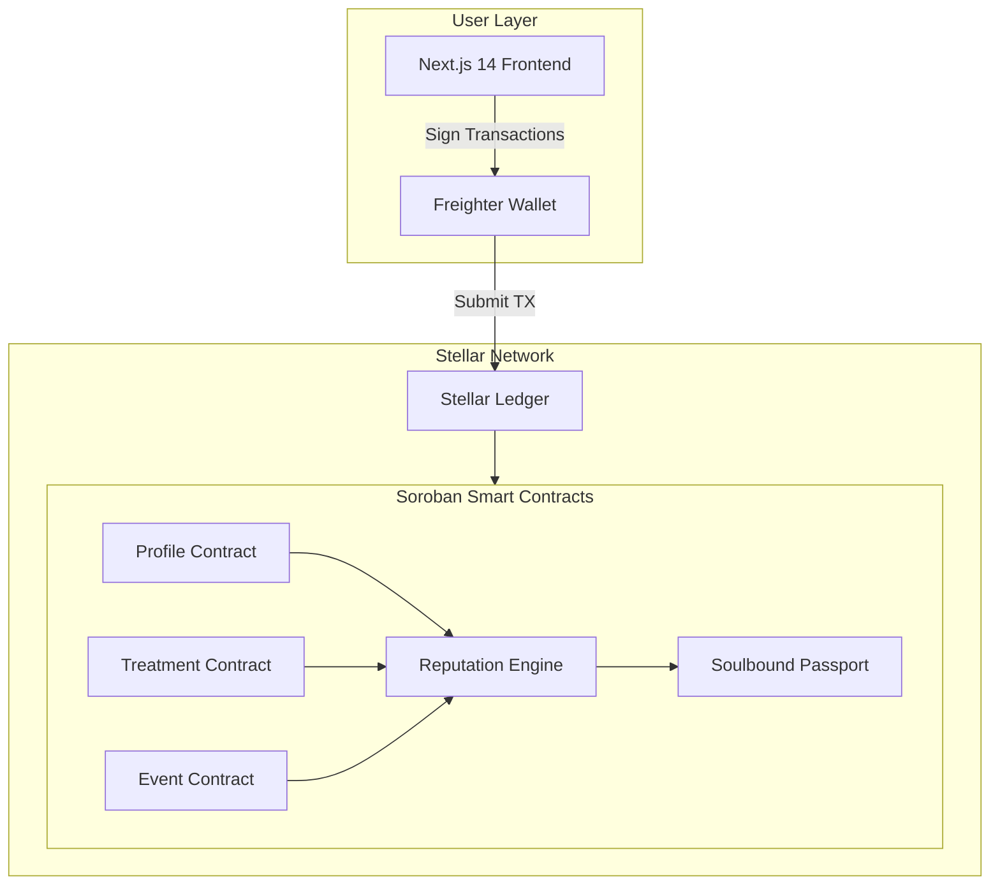

<p align="center">
  
</p>

<h1 align="center">CronoCapilar — Whitepaper</h1>
<h3 align="center">Proof of Care: A Decentralized Reputation Protocol for Natural Hair Care</h3>

<p align="center">
  <strong>Version 1.0 | March 2026</strong><br/>
  Angela Salles — <a href="https://ang3la.xyz">Ang3la.xyz</a>
</p>

---

## Table of Contents

1. [Executive Summary](#1-executive-summary)
2. [Market Analysis](#2-market-analysis)
3. [Problem Statement](#3-problem-statement)
4. [CronoCapilar: The Solution](#4-cronocapilar-the-solution)
5. [Why Stellar](#5-why-stellar)
6. [Protocol Architecture](#6-protocol-architecture)
7. [Proof of Care Protocol](#7-proof-of-care-protocol)
8. [Soulbound Passport (SBT)](#8-soulbound-passport-sbt)
9. [Reputation Engine](#9-reputation-engine)
10. [Community and Social Layer](#10-community-and-social-layer)
11. [Revenue Model](#11-revenue-model)
12. [Onboarding: Care First, Crypto Never](#12-onboarding-care-first-crypto-never)
13. [Competitive Analysis](#13-competitive-analysis)
14. [Governance](#14-governance)
15. [Roadmap](#15-roadmap)
16. [Team](#16-team)
17. [References](#17-references)

---

## 1. Executive Summary

The global hair care market exceeds US$90 billion annually, yet the experience for natural hair consumers remains fragmented, opaque, and driven by unreliable sources. People with curly, coily, and textured hair navigate a maze of products, routines, and conflicting advice — with no way to verify what actually works, for whom, and over what time period.

**CronoCapilar** is a decentralized social network built on [Stellar](https://stellar.org) that transforms daily hair care routines into verifiable, on-chain records called **Proof of Care**. Each treatment, event, and milestone is permanently recorded on the Stellar blockchain, forming an immutable hair care passport that belongs entirely to the user.

This passport feeds a **Reputation Engine** that rewards consistent self-care with community authority — not through speculation or token holdings, but through genuine, sustained action. The result is a trust layer that benefits everyone: users gain reliable peer insights, professionals gain client context, and brands gain authentic market intelligence.

CronoCapilar is free for every user, always. Revenue is generated through a curated Marketplace, B2B Intelligence reports, and Professional Tools — three pillars that monetize the trust layer without ever charging the people who create it.

---

## 2. Market Analysis

### 2.1 The Global Hair Care Industry

The hair care market is one of the largest segments within personal care, valued at over **US$90 billion** globally and growing steadily year over year. Within this market, the natural and textured hair segment is experiencing accelerated growth, driven by cultural movements celebrating natural beauty, increased representation in media, and a generational shift away from chemical straightening.

Key market dynamics:

- **Product proliferation without guidance.** Thousands of new products launch annually targeting curly and coily hair, yet consumers have no reliable mechanism to evaluate them beyond marketing claims and influencer endorsements.
- **High dissatisfaction rates.** Research conducted for the CronoCapilar Ignite pitch revealed that **68% of natural hair consumers** report dissatisfaction with their care routines, citing confusion about treatment scheduling and product selection as primary frustrations.
- **Professional disconnection.** Hair care professionals — stylists, trichologists, and salon owners — operate with minimal historical data about their clients' at-home routines, leading to suboptimal recommendations.

### 2.2 The Persona: Maria

During development, CronoCapilar identified a core persona that represents millions:

> **Maria** is a 28-year-old woman who transitioned to natural hair two years ago. She follows multiple influencers, has tried dozens of products, and maintains a mental schedule of Hydration, Nutrition, and Reconstruction treatments. Despite her effort, she doesn't know if her routine is actually working. She can't share her history with a stylist. She doesn't trust product reviews because she can't verify the reviewer's actual experience. Maria wants clarity, community, and proof that her dedication matters.

Maria represents a massive, underserved audience: people who care deeply about their hair but lack the infrastructure to care effectively.

### 2.3 The Trust Gap

The natural hair care ecosystem suffers from a structural trust deficit:

```
┌──────────────────────────────────────────────────────┐
│                  THE TRUST GAP                        │
├──────────────┬───────────────┬───────────────────────┤
│   Users      │  Professionals│     Brands             │
│   ─────      │  ─────────── │     ──────             │
│   No history │  No context   │     No real feedback   │
│   No proof   │  No timeline  │     No verified data   │
│   No trust   │  No continuity│     No earned trust    │
└──────────────┴───────────────┴───────────────────────┘
```

Every participant in the ecosystem — users, professionals, and brands — suffers from the absence of a shared, verifiable record of care. CronoCapilar fills this gap.

---

## 3. Problem Statement

### 3.1 The Frustration Cycle

The natural hair care experience, for most people, follows a predictable and exhausting cycle:

```
  ┌─────────────────────────────────────────────┐
  │           THE FRUSTRATION CYCLE              │
  │                                               │
  │    Confusion ──► Wrong Product ──► Failure    │
  │        ▲                              │       │
  │        │                              ▼       │
  │    No Record ◄── Frustration ◄── Wasted $    │
  │                                               │
  └─────────────────────────────────────────────┘
```

1. **Confusion** — The user doesn't know whether their hair needs Hydration, Nutrition, or Reconstruction at any given moment.
2. **Wrong product** — Without data or trustworthy guidance, they select products based on marketing, influencer posts, or trial and error.
3. **Failure** — The product doesn't deliver expected results because it wasn't the right treatment for the hair's current state.
4. **Wasted resources** — Time and money are lost on products that were never suitable.
5. **Frustration** — The user loses confidence in their ability to manage their own hair.
6. **No record** — Nothing was tracked, no lessons are preserved, and the cycle begins again.

### 3.2 Root Causes

The frustration cycle persists because of four systemic failures:

**No persistent memory.** Hair care routines exist only in the user's mind. There is no system to log treatments, track results over time, or identify patterns.

**No portable identity.** When a user visits a new professional, changes cities, or seeks advice online, they start from zero. There is no verifiable "hair resume" they can present.

**No credibility infrastructure.** On social media, a person who has never touched a deep conditioner has the same platform reach as someone with years of dedicated care. Expertise is not distinguished from performance.

**No professional continuity.** Stylists and trichologists rely entirely on client self-reporting — which is incomplete, biased, and inconsistent. Each appointment operates in isolation.

---

## 4. CronoCapilar: The Solution

### 4.1 Vision

CronoCapilar is not a hair care tracking app. It is a **decentralized social network** where self-care actions create identity, reputation, and community trust — all anchored to the Stellar blockchain.

The core insight is simple: **if care is visible, care becomes valuable.** When someone can prove — on an immutable ledger — that they have consistently cared for their hair over months or years, that proof transforms into authority. Authority creates trust. Trust creates community. Community creates value.

### 4.2 Core Experience

The user journey follows a natural progression:

```
  Sign in ──► Create Hair Profile ──► Daily Check-in (H/N/R)
                                                      │
                                                      ▼
                                            Register Events
                                          (Big Chop, cuts, color)
                                                      │
                                                      ▼
                                          Build Proof of Care
                                                      │
                                                      ▼
                                          Earn Reputation & Badges
                                                      │
                                                      ▼
                                          Engage Community
                                      (validate, share, mentor)
```

1. **Sign in** to CronoCapilar with your account (the app creates or connects a Stellar wallet in the background, e.g. [Freighter](https://www.freighter.app/))
2. **Create** an on-chain hair profile (type, length, texture, goals)
3. **Check in** daily with treatments: **H**ydration, **N**utrition, or **R**econstruction
4. **Register events** — Big Chop, haircuts, coloring, protein treatments, and other milestones
5. **Build** a Proof of Care timeline — an immutable record of the entire hair journey
6. **Earn** reputation, badges, and Soulbound Passport evolution through sustained care
7. **Engage** the community — validate peers, share insights, and build collective knowledge

### 4.3 What Makes It Different

CronoCapilar is not competing with hair care apps. It is building something that doesn't exist yet: **a trust infrastructure for hair care.**

| Traditional Apps | CronoCapilar |
|:-----------------|:-------------|
| Data stored on company servers | Data stored on Stellar blockchain |
| Platform owns user data | User owns their data |
| Reputation = followers | Reputation = verified care actions |
| Recommendations by algorithm | Recommendations by community authority |
| No portability | Portable Soulbound Passport |
| Professionals excluded | Professionals integrated |

---

## 5. Why Stellar

### 5.1 Philosophical Alignment

Stellar was created with a mission of financial inclusion — connecting the world's unbanked and underserved populations to the global economy. CronoCapilar shares this DNA: natural hair care disproportionately affects communities that have been historically marginalized in both beauty and finance. Building on Stellar means building on a foundation that was designed for the people CronoCapilar serves.

### 5.2 Technical Comparison

| Criteria | Stellar / Soroban | Ethereum / EVM | Solana |
|:---------|:------------------|:----------------|:-------|
| **Transaction cost** | < $0.01 | $1–50+ (variable) | < $0.01 |
| **Finality** | 3–5 seconds | ~15 seconds (L1) | ~400ms |
| **TPS** | 1,000+ | ~15 (L1) | ~4,000 |
| **Smart contracts** | Soroban (Rust/WASM) | Solidity (EVM) | Rust (BPF) |
| **Anchors & bridges** | Native (SEP standards) | Third-party bridges | Third-party bridges |
| **Identity focus** | Built-in (accounts, data entries) | External (ENS, etc.) | External |
| **Mission alignment** | Financial inclusion | General-purpose | High-performance DeFi |

### 5.3 Key Stellar Capabilities Used

- **Soroban Smart Contracts** — All protocol logic (profiles, treatments, reputation, passports) runs as Soroban contracts written in Rust, compiled to WASM.
- **Stellar Accounts & Manage Data** — User profiles leverage Stellar's native account data entries for lightweight identity storage.
- **SEP Standards** — Future integration with Stellar's Anchor ecosystem enables fiat on/off ramps for marketplace functionality.
- **Stellar wallet (e.g. Freighter)** — Used in the background for on-chain operations; users sign in to the app, not to the wallet.

---

## 6. Protocol Architecture

### 6.1 Architecture Overview



### 6.2 On-chain Layer (Soroban Contracts)

Five Soroban smart contracts form the protocol's on-chain core:

#### Profile Contract
Stores the user's hair care identity:
- Hair type (straight, wavy, curly, coily — using a numerical scale)
- Hair length category
- Hair texture and porosity
- Profile creation timestamp
- Owner (Stellar public key)

#### Treatment Contract
Records each daily care action:
- Treatment type: Hydration (H), Nutrition (N), or Reconstruction (R)
- Timestamp of registration
- Transaction hash (for verification)
- Optional notes hash (privacy-preserving)
- Owner reference

#### Event Contract
Captures significant hair journey milestones:
- Event type (Big Chop, haircut, coloring, protein treatment, transition milestone)
- Timestamp
- Optional description hash
- Owner reference

#### Reputation Engine Contract
Calculates and maintains the dynamic reputation score:
- Aggregates treatment frequency, streak data, diversity metrics, and validation signals
- Applies time-weighting and decay algorithms
- Emits reputation level thresholds (Bloom, Rise, Crown, Elder)
- Exposes read-only functions for community feed ranking

#### Soulbound Passport Contract
Manages the non-transferable identity token:
- Mints passport upon first treatment registration
- Updates badge tier based on Reputation Engine output
- Stores badge metadata (tier, visual variant, achievement milestones)
- Enforces non-transferability (soulbound constraint)

### 6.3 Off-chain Layer

- **Next.js 14 (App Router)** — Server-rendered React frontend with TypeScript, providing a fast and accessible user interface.
- **Stellar wallet integration (e.g. Freighter)** — Transaction signing and account management in the background; the app handles wallet creation/linking so users only sign in.
- **@tanstack/react-query** — Client-side state management and caching for on-chain data queries.
- **Custom i18n System** — Context-based internationalization supporting English, Portuguese (Brazil), and Spanish.

### 6.4 Data Flow

```
User Action (check-in)
       │
       ▼
Next.js Frontend builds transaction
       │
       ▼
Freighter signs transaction
       │
       ▼
Transaction submitted to Stellar network
       │
       ▼
Soroban Treatment Contract executes
       │
       ├──► Treatment stored on ledger
       │
       └──► Reputation Engine recalculates score
                    │
                    └──► Soulbound Passport updates (if tier threshold crossed)
```

---

## 7. Proof of Care Protocol

### 7.1 Definition

**Proof of Care (PoC)** is a non-financial, non-speculative reputation mechanism that quantifies consistent acts of self-care verified on-chain. It is the foundational primitive of the CronoCapilar network.

Unlike consensus mechanisms that secure blockchains (Proof of Work, Proof of Stake), Proof of Care secures **social trust** within a domain-specific community. It answers one question: *"Has this person consistently cared for their hair, and can that be verified?"*

### 7.2 What Generates Proof of Care

| Action | PoC Signal |
|:-------|:-----------|
| Daily treatment check-in (H/N/R) | Base contribution per registration |
| Maintaining a streak (consecutive days) | Increasing multiplier with streak length |
| Balanced treatment diversity (H + N + R) | Bonus for balanced routines |
| Registering a significant event | Milestone contribution |
| Receiving peer validation | Amplified weight from reputable endorsers |
| Mentoring or guiding new users | Community contribution signal |

### 7.3 Properties

**Non-transferable.** Proof of Care is bound to the user's Stellar account. It cannot be bought, sold, gifted, or delegated. This prevents reputation markets and ensures authenticity.

**Time-weighted.** Recent care activity is weighted more heavily than historical activity. A user who was active a year ago but has since stopped will see their effective PoC gradually decrease, reflecting their current state rather than past achievements.

**Decay-enabled.** Extended inactivity triggers a decay function that reduces reputation over time. Decay is gradual and non-punitive — it simply ensures that authority positions are held by currently active participants. Returning users can rebuild their reputation by resuming consistent care.

**Composable.** Proof of Care is a primitive that feeds into multiple systems: the Reputation Engine, the Soulbound Passport, the community feed ranking, the marketplace product visibility, and professional verification. Each system reads PoC data but interprets it through its own lens.

### 7.4 Conceptual Reputation Formula

The reputation score is a function of multiple dimensions:

```
Reputation = f(
    treatment_frequency,
    streak_continuity,
    treatment_diversity,
    peer_validations,
    event_milestones,
    time_decay_factor
)
```

Each dimension contributes to the overall score through a weighted aggregation. The specific weights and curves are designed to:

- Reward **consistency** over volume (daily small actions > occasional bursts)
- Reward **diversity** over repetition (balanced H/N/R > only Hydration)
- Reward **social engagement** over isolation (validated care > solo logging)
- Penalize **inactivity** gradually, not abruptly

The exact parameterization will be refined through community feedback and governance as the protocol matures.

---

## 8. Soulbound Passport (SBT)

### 8.1 Concept

The Soulbound Passport is a **non-transferable token** (Soulbound Token / SBT) minted on Stellar via Soroban. It represents the user's cumulative hair care identity and evolves visually as the user progresses through their journey.

The term "soulbound" reflects the token's core constraint: it is permanently bound to the user's account and cannot be transferred, sold, or duplicated. This makes the passport a genuine credential — its presence in a wallet means the owner earned it through real action.

### 8.2 Badge Tiers

The passport evolves through four tiers, each representing a deeper level of commitment:

| Tier | Name | Meaning | Visual Identity |
|:-----|:-----|:--------|:----------------|
| 1 | **Bloom** | Awakening — The user has begun their care journey and demonstrated initial consistency | Budding flower motif, soft warm tones |
| 2 | **Rise** | Growth — Sustained streaks, diversified treatments, and early community engagement | Rising sun motif, vibrant mid-tones |
| 3 | **Crown** | Authority — Deep consistency, peer validation, and recognized expertise | Crown motif, rich jewel tones |
| 4 | **Elder** | Legacy — Long-term dedication, mentorship, and lasting community impact | Ancient tree motif, deep earth tones |

### 8.3 Technical Specification

- **Token standard:** Soroban custom token with transfer restriction (soulbound)
- **Metadata storage:** On-chain badge tier, achievement milestones, and visual variant identifier; off-chain artwork stored on IPFS
- **Evolution trigger:** Reputation Engine emits events when tier thresholds are crossed; Passport contract listens and updates
- **Privacy:** The passport displays tier and badge publicly; detailed treatment history is only visible with user consent
- **Portability:** Because the passport lives on Stellar, it is accessible from any compatible wallet or dApp — users are never locked into CronoCapilar's frontend

### 8.4 Use Cases

- **Community credibility** — Badge tier is visible in the social feed, signaling the user's dedication level
- **Professional consultations** — A user presents their Passport to a stylist, providing verified care history context
- **Marketplace trust** — Product reviews from Crown and Elder users carry more weight in rankings
- **Cross-platform identity** — The Passport can be recognized by other Stellar-based applications, enabling interoperable reputation

---

## 9. Reputation Engine

### 9.1 Overview

The Reputation Engine is a Soroban smart contract that aggregates Proof of Care signals into a single, dynamic reputation score per user. This score determines visibility in the community feed, authority in peer validation, and influence in marketplace rankings.

### 9.2 Input Signals

The engine processes the following inputs for each user:

| Signal | Source | Description |
|:-------|:-------|:------------|
| Treatment count | Treatment Contract | Total number of registered treatments |
| Active streak | Treatment Contract | Current consecutive-day streak length |
| Longest streak | Treatment Contract | Historical best streak |
| Treatment mix | Treatment Contract | Distribution ratio of H:N:R |
| Event count | Event Contract | Number of milestone events registered |
| Validations received | Community Layer | Number of peer endorsements from other users |
| Validator reputation | Community Layer | Average reputation of endorsing users |
| Account age | Profile Contract | Time since profile creation |
| Last activity | Treatment Contract | Timestamp of most recent check-in |

### 9.3 Score Dynamics

The reputation score exhibits the following behaviors:

**Accumulation.** Every qualifying action increases the raw score. The rate of accumulation is designed so that dedicated daily users reach the Bloom tier within weeks, Rise within months, and Crown after sustained long-term activity. Elder is reserved for exceptional, multi-year contributors.

**Plateau resistance.** The scoring formula includes diminishing returns at high volumes to prevent gaming through rapid bulk registrations. Quality and consistency are favored over raw quantity.

**Decay.** When a user stops registering treatments, their score begins to decay after a grace period. Decay follows a gradual curve — never sudden or punitive — ensuring that temporary breaks (vacation, illness) don't destroy months of earned reputation. Extended absence, however, will significantly reduce the score, reflecting the principle that authority should belong to active participants.

**Recovery.** Users who return after a period of inactivity can rebuild their reputation by resuming consistent care. Recovery follows the same accumulation rules as initial growth, meaning the path back to a previous tier requires genuine re-engagement.

### 9.4 Anti-Gaming Measures

- **Rate limiting:** Maximum one treatment check-in per day prevents spam registrations
- **Streak verification:** Streaks require daily continuity, not batch submissions
- **Validation reciprocity limits:** Users cannot validate the same person repeatedly for amplified effect
- **Sybil resistance:** Passport non-transferability and progressive badge tiers make multi-account attacks economically irrational (each account must individually earn reputation through sustained action)

---

## 10. Community and Social Layer

### 10.1 Authority-Based Feed

Unlike traditional social networks where content visibility is driven by engagement metrics (likes, shares, algorithmic amplification), CronoCapilar's community feed ranks content by the author's **Proof of Care reputation**.

This means:

- Posts from Crown and Elder users appear more prominently — not because they are popular, but because they have demonstrated sustained care expertise
- New users (Bloom) can still post and participate, but their visibility grows as their reputation grows
- The algorithm is transparent and deterministic: reputation score directly maps to feed position weight

### 10.2 Peer Validation

Users can validate another user's treatment entries or shared experiences. Validation is a deliberate act — it requires reviewing the content and committing an on-chain endorsement. Validations carry weight proportional to the validator's own reputation:

- An endorsement from a Crown user contributes more to the recipient's reputation than one from a Bloom user
- This creates a mentorship incentive: experienced users are rewarded for curating quality content
- Validation is limited per user-pair per period to prevent collusion

### 10.3 Professional Verification

Hair care professionals (stylists, trichologists, salon owners) can apply for professional verification. Verified professionals receive:

- A distinct visual indicator on their profile and posts
- Access to client care timelines (with explicit client consent)
- Enhanced marketplace and recommendation visibility
- The ability to provide professional validations, which carry premium weight in the Reputation Engine

### 10.4 Community Challenges

Periodic community-wide challenges (e.g., "30-day hydration challenge," "balanced routine week") create shared experiences that boost engagement and introduce new users to consistent care habits. Challenge completion contributes to Proof of Care and can unlock special Passport visual variants.

---

## 11. Revenue Model

CronoCapilar is and will always be **100% free for end users.** The platform never charges users for creating profiles, registering treatments, building reputation, or participating in the community.

Revenue is generated through three pillars that monetize the trust infrastructure created by Proof of Care:

### 11.1 Marketplace

A curated product marketplace integrated into the CronoCapilar network where hair care brands and independent sellers can list products. The marketplace differentiates itself through Proof of Care integration:

- **Commission-based revenue:** Sellers pay a commission on each sale completed through the marketplace. CronoCapilar does not charge listing fees.
- **PoC-ranked reviews:** Product reviews are weighted by the reviewer's Proof of Care reputation. A Crown user's review carries demonstrably more authority than an anonymous review, creating genuine product differentiation.
- **Brand trust scores:** Brands whose products are consistently used by high-reputation users earn visibility through organic, verified data — not paid placement.
- **Community curation:** Products trending among verified users surface naturally, reducing the need for traditional advertising.

### 11.2 B2B Intelligence

Aggregated, anonymized insights derived from public on-chain data are packaged into intelligence products for hair care brands, product manufacturers, and market researchers:

- **Treatment trend reports:** What treatments are trending in which regions, demographics, and hair types
- **Product sentiment analysis:** How products correlate with sustained user engagement and positive care outcomes
- **Seasonal patterns:** How care routines shift across seasons, climates, and cultural events
- **Market segmentation:** Data-driven insights into underserved segments and emerging needs

All intelligence is derived from **publicly available on-chain data** and aggregated anonymously. Individual user data is never sold or exposed. Brands subscribe to intelligence tiers for access.

### 11.3 Pro Tools

A subscription service for hair care professionals offering premium features:

- **Client timeline access:** View a client's Proof of Care history (with their explicit wallet-based consent) before and during appointments
- **Appointment context:** Understand what treatments a client has been doing at home, enabling more targeted in-salon care
- **Professional reputation building:** Verified professionals build their own Proof of Care through client outcomes and community contributions
- **Referral network:** Connect with clients seeking professional care through the CronoCapilar network, ranked by professional reputation

---

## 12. Onboarding: Care First, Crypto Never

### 12.1 The Web3 Adoption Challenge

The biggest barrier to Web3 adoption is not technology — it is language. Terms like "blockchain," "wallet," "transaction signing," and "gas fees" alienate the exact communities that would benefit most from decentralized systems. CronoCapilar addresses this through a deliberate onboarding philosophy: **Care First, Crypto Never.**

### 12.2 Strategy

**The user never needs to say "blockchain."** The onboarding flow focuses entirely on hair care:

1. "Create your hair profile" (not "mint an NFT")
2. "Register your treatment" (not "submit a transaction")
3. "Build your hair care passport" (not "accumulate soulbound tokens")
4. "Sign in to CronoCapilar" (we connect a Stellar wallet for you in the background)

**No wallet login required.** Users sign in to the app as they would to any other service. The Stellar wallet (e.g. Freighter) is created or linked in the background; the user never has to think in terms of "connecting a wallet" or "managing keys" unless they choose to.

**Costs are invisible.** Stellar's near-zero fees mean the user never encounters a "gas fee" dialog. The experience of registering a treatment feels identical to pressing a button in a traditional app.

**Blockchain is an implementation detail.** The benefits — immutability, portability, user ownership — are communicated in terms of trust and permanence, not technology. "Your data belongs to you" is more meaningful than "your data is on a decentralized ledger."

### 12.3 Progressive Disclosure

For users who are curious about the technology, CronoCapilar provides optional educational content:

- In-app explanations of why data is stored on Stellar
- Links to transaction records on Stellar explorers
- Guides for advanced features (including optional wallet export)
- Community discussions about decentralization and data ownership

This ensures that technically curious users can go deeper without forcing technical complexity on everyone.

---

## 13. Competitive Analysis

### 13.1 vs. Traditional Hair Care Apps

Several apps exist for tracking hair care routines (scheduling treatments, product logs, etc.). These apps share common limitations:

| Dimension | Traditional Apps | CronoCapilar |
|:----------|:-----------------|:-------------|
| Data ownership | Company-controlled servers | User-controlled (Stellar blockchain) |
| Portability | Locked to platform | Portable via Soulbound Passport |
| Reputation | None or follower-based | Proof of Care (verified actions) |
| Trust mechanism | Star ratings, reviews | On-chain verified reputation |
| Professional integration | None | Native (Pro Tools) |
| Revenue source | Ads, premium tiers, data selling | Marketplace, B2B Intelligence, Pro Tools |
| User cost | Free tier + paid features | 100% free, always |

### 13.2 vs. Influencer-Driven Advice

Social media influencers dominate hair care recommendations. The problems are well-documented:

- **Paid endorsements** are often undisclosed or poorly disclosed
- **No verification** of the influencer's actual hair care history or expertise
- **Algorithmic amplification** rewards engagement, not accuracy
- **No accountability** for bad recommendations

CronoCapilar inverts this model: visibility is earned through verified care actions. A user who has maintained a 200-day care streak and received endorsements from other verified users has more authority than someone with a large follower count but no verifiable care history.

### 13.3 vs. Other Web3 Social Networks

Several Web3 social networks have launched (Lens Protocol, Farcaster, etc.), but none are domain-specific to hair care or personal wellness. CronoCapilar's differentiation:

- **Domain-specific reputation.** Proof of Care is meaningful only in the context of hair care. This focus creates a moat that general-purpose networks cannot replicate.
- **Non-speculative.** CronoCapilar has no governance token, no staking, no yield farming. Reputation is earned through care, not capital.
- **Inclusive onboarding.** The "Care First, Crypto Never" approach is designed for communities that are typically excluded from Web3, not for crypto-native audiences.
- **Built on Stellar, not EVM.** Lower costs, faster finality, and alignment with financial inclusion values distinguish CronoCapilar from EVM-based social protocols.

---

## 14. Governance

### 14.1 Current State

CronoCapilar launches with centralized governance. Protocol parameters, feature development, and community policies are managed by the core team. This is deliberate: early-stage protocols benefit from focused, responsive decision-making.

### 14.2 Future Vision

As the community matures and the Reputation Engine establishes a reliable trust layer, CronoCapilar will progressively decentralize governance:

- **Reputation-weighted voting.** Protocol decisions (parameter changes, feature priorities, marketplace policies) will be decided by community vote, where voting power is proportional to Proof of Care reputation — not token holdings.
- **Council formation.** Elder-tier users may form advisory councils that propose and review protocol changes before community vote.
- **Professional representation.** Verified professionals will have dedicated governance channels to ensure the protocol serves both consumer and professional needs.
- **Transparent processes.** All governance proposals, discussions, and votes will be recorded on-chain for full transparency.

The governance model is intentionally reputation-based rather than token-based. This ensures that the people who have demonstrated the most consistent care — the people most invested in the protocol's mission — hold the most influence over its direction.

---

## 15. Roadmap

### Phase 1 — Foundation
*Current phase*

- Core application: Next.js 14 + TypeScript + Stellar integration
- Sign-in (Stellar wallet in background, e.g. Freighter)
- On-chain hair profile creation
- Daily treatment check-in (H/N/R) with streak tracking
- Visual timeline of hair care journey
- Event registration (Big Chop, haircuts, coloring)
- Full internationalization (English, Portuguese, Spanish)
- Responsive design (mobile, tablet, desktop)
- Deploy on Stellar Testnet

### Phase 2 — Protocol

- Soroban smart contract deployment (Profile, Treatment, Event, ReputationEngine, SoulboundPassport)
- Proof of Care engine with on-chain reputation scoring
- Soulbound Passport minting with badge tiers (Bloom, Rise, Crown, Elder)
- On-chain streak verification
- Stellar Mainnet deployment
- Security audits

### Phase 3 — Community

- Social feed ranked by Proof of Care reputation
- Peer validation system
- Professional verification process
- Community challenges
- Mentorship features
- AI-powered hair diagnosis (photo-based analysis)
- Product recommendation engine (community-driven)

### Phase 4 — Economy

- Marketplace launch with PoC-ranked reviews
- B2B Intelligence platform
- Pro Tools subscription for professionals
- Anchor integration for fiat on/off ramps
- Governance framework design and initial voting mechanisms
- Cross-platform partnerships and API access

---

## 16. Team

**Angela Salles** — Founder & Builder
[Ang3la.xyz](https://ang3la.xyz)

Angela is the creator and driving force behind CronoCapilar. With deep personal experience in the natural hair care journey and a passion for decentralized technology, she conceived CronoCapilar as the intersection of two worlds: the cultural power of hair care communities and the trust infrastructure of blockchain. Angela leads product vision, protocol design, and community development.

---

## 17. References

1. **Stellar Development Foundation.** *Stellar Documentation.* [https://developers.stellar.org](https://developers.stellar.org)
2. **Soroban Smart Contracts.** *Soroban Documentation.* [https://soroban.stellar.org](https://soroban.stellar.org)
3. **Weyl, E. G., Ohlhaver, P., & Buterin, V.** (2022). *Decentralized Society: Finding Web3's Soul.* SSRN.
4. **Global Hair Care Market Report.** Market research data referencing the US$90B+ global hair care industry.
5. **CronoCapilar Ignite Pitch.** Internal research data: persona development, dissatisfaction survey (68% metric), market opportunity analysis.
6. **Freighter Wallet.** *Stellar Wallet for the Web.* [https://www.freighter.app](https://www.freighter.app)
7. **SEP Standards (Stellar Ecosystem Proposals).** [https://github.com/stellar/stellar-protocol/tree/master/ecosystem](https://github.com/stellar/stellar-protocol/tree/master/ecosystem)

---

<p align="center">
  <strong>Built with care on <a href="https://stellar.org">Stellar</a></strong>
</p>

<p align="center">
  <a href="LITEPAPER.md">Read the Litepaper</a>
</p>
