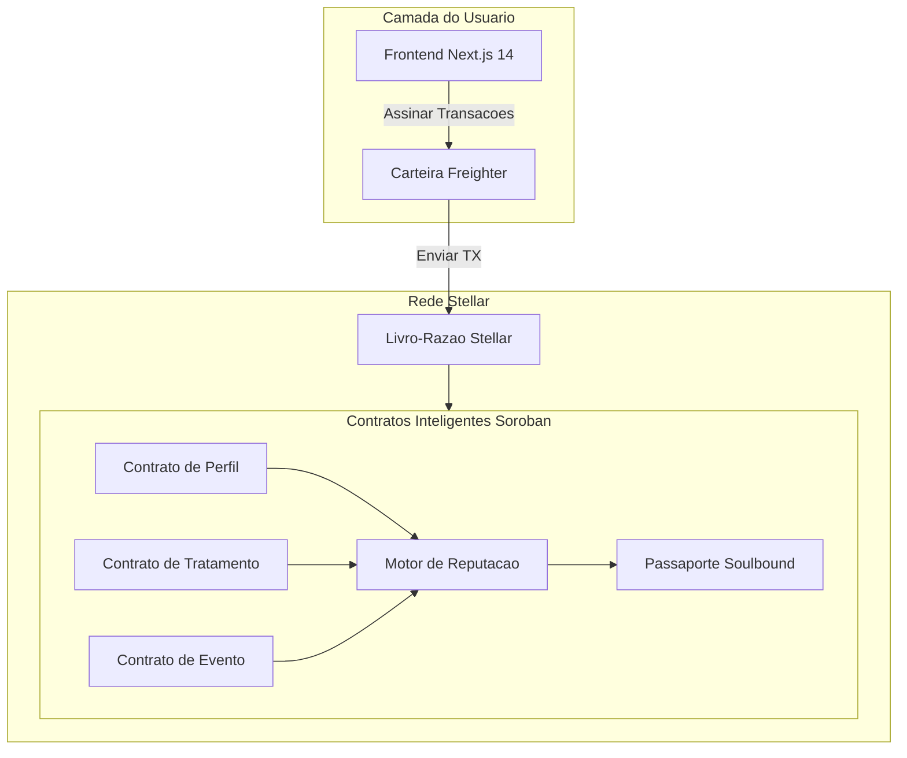

<p align="center">
  
</p>

<h1 align="center">CronoCapilar — Whitepaper</h1>
<h3 align="center">Proof of Care: Um Protocolo de Reputacao Descentralizada para Cuidados Capilares Naturais</h3>

<p align="center">
  <strong>Versao 1.0 | Marco 2026</strong><br/>
  Angela Salles — <a href="https://ang3la.xyz">Ang3la.xyz</a>
</p>

---

## Indice

1. [Resumo Executivo](#1-resumo-executivo)
2. [Analise de Mercado](#2-analise-de-mercado)
3. [Declaracao do Problema](#3-declaracao-do-problema)
4. [CronoCapilar: A Solucao](#4-cronocapilar-a-solucao)
5. [Por que Stellar](#5-por-que-stellar)
6. [Arquitetura do Protocolo](#6-arquitetura-do-protocolo)
7. [Protocolo Proof of Care](#7-protocolo-proof-of-care)
8. [Passaporte Soulbound (SBT)](#8-passaporte-soulbound-sbt)
9. [Motor de Reputacao](#9-motor-de-reputacao)
10. [Camada Comunitaria e Social](#10-camada-comunitaria-e-social)
11. [Modelo de Receita](#11-modelo-de-receita)
12. [Onboarding: Cuidado Primeiro, Cripto Nunca](#12-onboarding-cuidado-primeiro-cripto-nunca)
13. [Analise Competitiva](#13-analise-competitiva)
14. [Governanca](#14-governanca)
15. [Roadmap](#15-roadmap)
16. [Time](#16-time)
17. [Referencias](#17-referencias)

---

## 1. Resumo Executivo

O mercado global de cuidados capilares ultrapassa US$90 bilhoes anualmente, mas a experiencia para consumidores de cabelo natural permanece fragmentada, opaca e movida por fontes pouco confiaveis. Pessoas com cabelo cacheado, crespo e texturizado navegam em um labirinto de produtos, rotinas e conselhos conflitantes — sem como verificar o que realmente funciona, para quem e durante quanto tempo.

**CronoCapilar** e uma rede social descentralizada construida na [Stellar](https://stellar.org) que transforma rotinas diarias de cuidado capilar em registros verificaveis on-chain chamados **Proof of Care**. Cada tratamento, evento e marco e permanentemente registrado na blockchain Stellar, formando um passaporte capilar imutavel que pertence inteiramente ao usuario.

Esse passaporte alimenta um **Motor de Reputacao** que recompensa o autocuidado consistente com autoridade comunitaria — nao por especulacao ou posse de tokens, mas por acao genuina e sustentada. O resultado e uma camada de confianca que beneficia todos: usuarios ganham insights confiaveis de pares, profissionais ganham contexto sobre clientes, e marcas ganham inteligencia de mercado autentica.

O CronoCapilar e gratuito para todos os usuarios, sempre. A receita e gerada por um Marketplace curado, relatorios de B2B Intelligence e Ferramentas Profissionais — tres pilares que monetizam a camada de confianca sem jamais cobrar as pessoas que a criam.

---

## 2. Analise de Mercado

### 2.1 A Industria Global de Cuidados Capilares

O mercado de cuidados capilares e um dos maiores segmentos dentro de cuidados pessoais, avaliado em mais de **US$90 bilhoes** globalmente e crescendo de forma consistente ano apos ano. Dentro desse mercado, o segmento de cabelos naturais e texturizados experimenta crescimento acelerado, impulsionado por movimentos culturais que celebram a beleza natural, maior representacao na midia e uma mudanca geracional contra o alisamento quimico.

Dinamicas-chave do mercado:

- **Proliferacao de produtos sem orientacao.** Milhares de novos produtos sao lancados anualmente voltados para cabelos cacheados e crespos, mas consumidores nao tem um mecanismo confiavel para avalia-los alem de alegacoes de marketing e recomendacoes de influenciadores.
- **Altas taxas de insatisfacao.** Pesquisa conduzida para o pitch CronoCapilar Ignite revelou que **68% dos consumidores de cabelo natural** reportam insatisfacao com suas rotinas de cuidado, citando confusao sobre agendamento de tratamentos e selecao de produtos como principais frustracoes.
- **Desconexao profissional.** Profissionais de cuidados capilares — estilistas, tricologistas e donos de salao — operam com dados historicos minimos sobre as rotinas caseiras de seus clientes, levando a recomendacoes subotimas.

### 2.2 A Persona: Maria

Durante o desenvolvimento, o CronoCapilar identificou uma persona central que representa milhoes:

> **Maria** tem 28 anos e fez transicao para cabelo natural ha dois anos. Ela segue multiplos influenciadores, ja experimentou dezenas de produtos e mantem um calendario mental de tratamentos de Hidratacao, Nutricao e Reconstrucao. Apesar de seu esforco, ela nao sabe se sua rotina esta realmente funcionando. Ela nao consegue compartilhar seu historico com um estilista. Ela nao confia em avaliacoes de produtos porque nao pode verificar a experiencia real do avaliador. Maria quer clareza, comunidade e a prova de que sua dedicacao importa.

Maria representa uma audiencia massiva e subatendida: pessoas que se importam profundamente com seus cabelos mas carecem da infraestrutura para cuidar de forma eficaz.

### 2.3 A Lacuna de Confianca

O ecossistema de cuidados capilares naturais sofre de um deficit estrutural de confianca:

```
┌──────────────────────────────────────────────────────┐
│                  A LACUNA DE CONFIANCA                 │
├──────────────┬───────────────┬───────────────────────┤
│   Usuarios   │  Profissionais│     Marcas             │
│   ────────   │  ───────────  │     ──────             │
│   Sem hist.  │  Sem contexto │     Sem feedback real  │
│   Sem prova  │  Sem timeline │     Sem dados verif.   │
│   Sem conf.  │  Sem contin.  │     Sem confianca ganha│
└──────────────┴───────────────┴───────────────────────┘
```

Cada participante do ecossistema — usuarios, profissionais e marcas — sofre com a ausencia de um registro compartilhado e verificavel de cuidado. O CronoCapilar preenche essa lacuna.

---

## 3. Declaracao do Problema

### 3.1 O Ciclo de Frustracao

A experiencia de cuidado capilar natural, para a maioria das pessoas, segue um ciclo previsivel e exaustivo:

```
  ┌─────────────────────────────────────────────┐
  │           O CICLO DE FRUSTRACAO              │
  │                                               │
  │    Confusao ──► Produto Errado ──► Falha     │
  │        ▲                              │       │
  │        │                              ▼       │
  │    Sem Registro ◄── Frustracao ◄── $ Perdido │
  │                                               │
  └─────────────────────────────────────────────┘
```

1. **Confusao** — O usuario nao sabe se seu cabelo precisa de Hidratacao, Nutricao ou Reconstrucao naquele momento.
2. **Produto errado** — Sem dados ou orientacao confiavel, seleciona produtos com base em marketing, posts de influenciadores ou tentativa e erro.
3. **Falha** — O produto nao entrega os resultados esperados porque nao era o tratamento certo para o estado atual do cabelo.
4. **Recursos desperdicados** — Tempo e dinheiro sao perdidos em produtos que nunca foram adequados.
5. **Frustracao** — O usuario perde confianca em sua capacidade de gerenciar seu proprio cabelo.
6. **Sem registro** — Nada foi rastreado, nenhuma licao e preservada, e o ciclo recomeca.

### 3.2 Causas Raiz

O ciclo de frustracao persiste por quatro falhas sistemicas:

**Sem memoria persistente.** Rotinas capilares existem apenas na mente do usuario. Nao ha sistema para registrar tratamentos, acompanhar resultados ao longo do tempo ou identificar padroes.

**Sem identidade portatil.** Quando um usuario visita um novo profissional, muda de cidade ou busca conselhos online, comeca do zero. Nao existe um "curriculo capilar" verificavel que possa apresentar.

**Sem infraestrutura de credibilidade.** Nas redes sociais, uma pessoa que nunca tocou em um condicionador profundo tem o mesmo alcance de plataforma que alguem com anos de cuidado dedicado. Expertise nao e distinguida de performance.

**Sem continuidade profissional.** Estilistas e tricologistas dependem inteiramente do auto-relato do cliente — que e incompleto, tendencioso e inconsistente. Cada consulta opera em isolamento.

---

## 4. CronoCapilar: A Solucao

### 4.1 Visao

CronoCapilar nao e um app de rastreamento capilar. E uma **rede social descentralizada** onde acoes de autocuidado criam identidade, reputacao e confianca comunitaria — tudo ancorado na blockchain Stellar.

O insight central e simples: **se o cuidado e visivel, o cuidado se torna valioso.** Quando alguem pode provar — em um livro-razao imutavel — que consistentemente cuidou de seu cabelo por meses ou anos, essa prova se transforma em autoridade. Autoridade cria confianca. Confianca cria comunidade. Comunidade cria valor.

### 4.2 Experiencia Central

A jornada do usuario segue uma progressao natural:

```
  Entrar no App ──► Criar Perfil Capilar ──► Check-in Diario (H/N/R)
                                                         │
                                                         ▼
                                               Registrar Eventos
                                             (Big Chop, cortes, cor)
                                                         │
                                                         ▼
                                             Construir Proof of Care
                                                         │
                                                         ▼
                                             Ganhar Reputacao & Badges
                                                         │
                                                         ▼
                                             Engajar Comunidade
                                         (validar, compartilhar, mentorar)
```

1. **Acesse** o CronoCapilar com sua conta (nos bastidores, o app cria/conecta uma carteira Stellar compativel, ex.: [Freighter](https://www.freighter.app/))
2. **Crie** um perfil capilar on-chain (tipo, comprimento, textura, objetivos)
3. **Faca check-in** diario com tratamentos: **H**idratacao, **N**utricao ou **R**econstrucao
4. **Registre eventos** — Big Chop, cortes, coloracao, tratamentos de proteina e outros marcos
5. **Construa** uma timeline de Proof of Care — um registro imutavel de toda a jornada capilar
6. **Ganhe** reputacao, badges e evolucao do Passaporte Soulbound por cuidado sustentado
7. **Engaje** a comunidade — valide pares, compartilhe insights e construa conhecimento coletivo

### 4.3 O Que Torna Diferente

CronoCapilar nao esta competindo com apps de cuidado capilar. Esta construindo algo que ainda nao existe: **uma infraestrutura de confianca para cuidados capilares.**

| Apps Tradicionais | CronoCapilar |
|:------------------|:-------------|
| Dados em servidores da empresa | Dados na blockchain Stellar |
| Plataforma dona dos dados | Usuario dono dos seus dados |
| Reputacao = seguidores | Reputacao = acoes de cuidado verificadas |
| Recomendacoes por algoritmo | Recomendacoes por autoridade comunitaria |
| Sem portabilidade | Passaporte Soulbound portatil |
| Profissionais excluidos | Profissionais integrados |

---

## 5. Por que Stellar

### 5.1 Alinhamento Filosofico

A Stellar foi criada com a missao de inclusao financeira — conectando populacoes desbancarizadas e subatendidas do mundo a economia global. O CronoCapilar compartilha esse DNA: cuidados capilares naturais afetam desproporcionalmente comunidades que foram historicamente marginalizadas tanto na beleza quanto nas financas. Construir na Stellar significa construir sobre uma fundacao projetada para as pessoas que o CronoCapilar atende.

### 5.2 Comparativo Tecnico

| Criterio | Stellar / Soroban | Ethereum / EVM | Solana |
|:---------|:------------------|:----------------|:-------|
| **Custo de transacao** | < $0,01 | $1–50+ (variavel) | < $0,01 |
| **Finalidade** | 3–5 segundos | ~15 segundos (L1) | ~400ms |
| **TPS** | 1.000+ | ~15 (L1) | ~4.000 |
| **Contratos inteligentes** | Soroban (Rust/WASM) | Solidity (EVM) | Rust (BPF) |
| **Anchors & bridges** | Nativo (padroes SEP) | Bridges de terceiros | Bridges de terceiros |
| **Foco em identidade** | Nativo (contas, data entries) | Externo (ENS, etc.) | Externo |
| **Alinhamento de missao** | Inclusao financeira | Proposito geral | DeFi de alta performance |

### 5.3 Capacidades Stellar Utilizadas

- **Contratos Inteligentes Soroban** — Toda logica do protocolo (perfis, tratamentos, reputacao, passaportes) roda como contratos Soroban escritos em Rust, compilados para WASM.
- **Contas Stellar & Manage Data** — Perfis de usuarios aproveitam as entradas de dados nativos de contas Stellar para armazenamento leve de identidade.
- **Padroes SEP** — Integracao futura com o ecossistema de Anchors da Stellar habilita rampas de entrada/saida fiat para funcionalidade de marketplace.
- **Carteira Stellar (ex.: Freighter)** — Usada em segundo plano nas operacoes on-chain; o usuario faz login no app, nao na carteira.

---

## 6. Arquitetura do Protocolo

### 6.1 Visao Geral da Arquitetura



### 6.2 Camada On-chain (Contratos Soroban)

Cinco contratos inteligentes Soroban formam o nucleo on-chain do protocolo:

#### Contrato de Perfil
Armazena a identidade de cuidado capilar do usuario:
- Tipo de cabelo (liso, ondulado, cacheado, crespo — usando escala numerica)
- Categoria de comprimento
- Textura e porosidade do cabelo
- Timestamp de criacao do perfil
- Proprietario (chave publica Stellar)

#### Contrato de Tratamento
Registra cada acao diaria de cuidado:
- Tipo de tratamento: Hidratacao (H), Nutricao (N) ou Reconstrucao (R)
- Timestamp do registro
- Hash da transacao (para verificacao)
- Hash de notas opcional (preservando privacidade)
- Referencia do proprietario

#### Contrato de Evento
Captura marcos significativos da jornada capilar:
- Tipo de evento (Big Chop, corte, coloracao, tratamento de proteina, marco de transicao)
- Timestamp
- Hash de descricao opcional
- Referencia do proprietario

#### Contrato Motor de Reputacao
Calcula e mantem o score de reputacao dinamico:
- Agrega frequencia de tratamentos, dados de sequencias, metricas de diversidade e sinais de validacao
- Aplica algoritmos de ponderacao temporal e decaimento
- Emite limiares de nivel de reputacao (Bloom, Rise, Crown, Elder)
- Expoe funcoes somente-leitura para ranqueamento do feed comunitario

#### Contrato Passaporte Soulbound
Gerencia o token de identidade intransferivel:
- Cunha o passaporte apos o primeiro registro de tratamento
- Atualiza o nivel do badge com base na saida do Motor de Reputacao
- Armazena metadados do badge (nivel, variante visual, marcos de conquista)
- Aplica intransferibilidade (restricao soulbound)

### 6.3 Camada Off-chain

- **Next.js 14 (App Router)** — Frontend React renderizado no servidor com TypeScript, fornecendo uma interface de usuario rapida e acessivel.
- **Integracao com carteira Stellar (ex.: Freighter)** — Assinatura de transacoes e gerenciamento de contas em segundo plano; o app cuida da criacao/vinculo da carteira para o usuario apenas entrar.
- **@tanstack/react-query** — Gerenciamento de estado e cache do lado do cliente para consultas de dados on-chain.
- **Sistema i18n Personalizado** — Internacionalizacao baseada em contexto suportando Ingles, Portugues (Brasil) e Espanhol.

### 6.4 Fluxo de Dados

```
Acao do Usuario (check-in)
       │
       ▼
Frontend Next.js constroi transacao
       │
       ▼
Freighter assina transacao
       │
       ▼
Transacao submetida a rede Stellar
       │
       ▼
Contrato Soroban de Tratamento executa
       │
       ├──► Tratamento armazenado no ledger
       │
       └──► Motor de Reputacao recalcula score
                    │
                    └──► Passaporte Soulbound atualiza (se limiar de nivel cruzado)
```

---

## 7. Protocolo Proof of Care

### 7.1 Definicao

**Proof of Care (PoC)** e um mecanismo de reputacao nao-financeiro e nao-especulativo que quantifica atos consistentes de autocuidado verificados on-chain. E a primitiva fundamental da rede CronoCapilar.

Diferente de mecanismos de consenso que protegem blockchains (Proof of Work, Proof of Stake), o Proof of Care protege a **confianca social** dentro de uma comunidade de dominio especifico. Ele responde uma pergunta: *"Essa pessoa cuidou consistentemente de seu cabelo, e isso pode ser verificado?"*

### 7.2 O Que Gera Proof of Care

| Acao | Sinal PoC |
|:-----|:----------|
| Check-in diario de tratamento (H/N/R) | Contribuicao base por registro |
| Manter uma sequencia (dias consecutivos) | Multiplicador crescente com duracao da sequencia |
| Diversidade de tratamentos balanceada (H + N + R) | Bonus por rotinas equilibradas |
| Registrar um evento significativo | Contribuicao de marco |
| Receber validacao de pares | Peso amplificado por endossantes reputados |
| Mentorar ou guiar novos usuarios | Sinal de contribuicao comunitaria |

### 7.3 Propriedades

**Intransferivel.** Proof of Care esta vinculado a conta Stellar do usuario. Nao pode ser comprado, vendido, presenteado ou delegado. Isso previne mercados de reputacao e garante autenticidade.

**Ponderado pelo tempo.** Atividade de cuidado recente tem peso maior que atividade historica. Um usuario que era ativo ha um ano mas parou desde entao vera seu PoC efetivo diminuir gradualmente, refletindo seu estado atual em vez de conquistas passadas.

**Com decaimento.** Inatividade prolongada aciona uma funcao de decaimento que reduz a reputacao ao longo do tempo. O decaimento e gradual e nao-punitivo — simplesmente garante que posicoes de autoridade sejam ocupadas por participantes atualmente ativos. Usuarios que retornam podem reconstruir sua reputacao retomando o cuidado consistente.

**Componivel.** Proof of Care e uma primitiva que alimenta multiplos sistemas: o Motor de Reputacao, o Passaporte Soulbound, o ranqueamento do feed comunitario, a visibilidade de produtos no marketplace e a verificacao profissional. Cada sistema le dados de PoC mas os interpreta por sua propria lente.

### 7.4 Formula Conceitual de Reputacao

O score de reputacao e uma funcao de multiplas dimensoes:

```
Reputacao = f(
    frequencia_de_tratamentos,
    continuidade_de_sequencia,
    diversidade_de_tratamentos,
    validacoes_de_pares,
    marcos_de_eventos,
    fator_de_decaimento_temporal
)
```

Cada dimensao contribui para o score geral por uma agregacao ponderada. Os pesos e curvas especificos sao projetados para:

- Recompensar **consistencia** sobre volume (pequenas acoes diarias > picos ocasionais)
- Recompensar **diversidade** sobre repeticao (H/N/R balanceado > apenas Hidratacao)
- Recompensar **engajamento social** sobre isolamento (cuidado validado > registro solo)
- Penalizar **inatividade** gradualmente, nao abruptamente

A parametrizacao exata sera refinada por feedback comunitario e governanca conforme o protocolo amadurece.

---

## 8. Passaporte Soulbound (SBT)

### 8.1 Conceito

O Passaporte Soulbound e um **token intransferivel** (Soulbound Token / SBT) cunhado na Stellar via Soroban. Ele representa a identidade acumulada de cuidado capilar do usuario e evolui visualmente conforme o usuario progride em sua jornada.

O termo "soulbound" reflete a restricao central do token: esta permanentemente vinculado a conta do usuario e nao pode ser transferido, vendido ou duplicado. Isso torna o passaporte uma credencial genuina — sua presenca em uma carteira significa que o proprietario o conquistou por acao real.

### 8.2 Niveis de Badges

O passaporte evolui por quatro niveis, cada um representando um grau mais profundo de comprometimento:

| Nivel | Nome | Significado | Identidade Visual |
|:------|:-----|:------------|:------------------|
| 1 | **Bloom** | Despertar — O usuario comecou sua jornada de cuidados e demonstrou consistencia inicial | Motivo de flor brotando, tons quentes suaves |
| 2 | **Rise** | Crescimento — Sequencias sustentadas, tratamentos diversificados e engajamento comunitario inicial | Motivo de sol nascente, tons medios vibrantes |
| 3 | **Crown** | Autoridade — Consistencia profunda, validacao por pares e expertise reconhecida | Motivo de coroa, tons de joias ricos |
| 4 | **Elder** | Legado — Dedicacao de longo prazo, mentoria e impacto comunitario duradouro | Motivo de arvore ancestral, tons terrosos profundos |

### 8.3 Especificacao Tecnica

- **Padrao de token:** Token customizado Soroban com restricao de transferencia (soulbound)
- **Armazenamento de metadados:** Nivel de badge on-chain, marcos de conquista e identificador de variante visual; arte off-chain armazenada em IPFS
- **Gatilho de evolucao:** Motor de Reputacao emite eventos quando limiares de nivel sao cruzados; contrato do Passaporte escuta e atualiza
- **Privacidade:** O passaporte exibe nivel e badge publicamente; historico detalhado de tratamentos so e visivel com consentimento do usuario
- **Portabilidade:** Como o passaporte vive na Stellar, e acessivel de qualquer carteira ou dApp compativel — usuarios nunca ficam presos ao frontend do CronoCapilar

### 8.4 Casos de Uso

- **Credibilidade comunitaria** — O nivel do badge e visivel no feed social, sinalizando o nivel de dedicacao do usuario
- **Consultas profissionais** — Um usuario apresenta seu Passaporte a um estilista, fornecendo contexto de historico de cuidado verificado
- **Confianca no marketplace** — Avaliacoes de produtos de usuarios Crown e Elder carregam mais peso nos rankings
- **Identidade cross-platform** — O Passaporte pode ser reconhecido por outras aplicacoes baseadas em Stellar, habilitando reputacao interoperavel

---

## 9. Motor de Reputacao

### 9.1 Visao Geral

O Motor de Reputacao e um contrato inteligente Soroban que agrega sinais de Proof of Care em um unico score de reputacao dinamico por usuario. Esse score determina visibilidade no feed comunitario, autoridade na validacao de pares e influencia nos rankings do marketplace.

### 9.2 Sinais de Entrada

O motor processa as seguintes entradas para cada usuario:

| Sinal | Fonte | Descricao |
|:------|:------|:----------|
| Contagem de tratamentos | Contrato de Tratamento | Total de tratamentos registrados |
| Sequencia ativa | Contrato de Tratamento | Comprimento da sequencia atual de dias consecutivos |
| Maior sequencia | Contrato de Tratamento | Melhor sequencia historica |
| Mix de tratamentos | Contrato de Tratamento | Proporcao de distribuicao H:N:R |
| Contagem de eventos | Contrato de Evento | Numero de eventos marco registrados |
| Validacoes recebidas | Camada Comunitaria | Numero de endossos de pares de outros usuarios |
| Reputacao do validador | Camada Comunitaria | Reputacao media dos usuarios endossantes |
| Idade da conta | Contrato de Perfil | Tempo desde a criacao do perfil |
| Ultima atividade | Contrato de Tratamento | Timestamp do check-in mais recente |

### 9.3 Dinamicas do Score

O score de reputacao exibe os seguintes comportamentos:

**Acumulacao.** Cada acao qualificante aumenta o score bruto. A taxa de acumulacao e projetada para que usuarios diarios dedicados alcancem o nivel Bloom em semanas, Rise em meses e Crown apos atividade sustentada de longo prazo. Elder e reservado para contribuidores excepcionais de multiplos anos.

**Resistencia a plato.** A formula de pontuacao inclui retornos decrescentes em altos volumes para prevenir gaming por registros rapidos em massa. Qualidade e consistencia sao favorecidas sobre quantidade bruta.

**Decaimento.** Quando um usuario para de registrar tratamentos, seu score comeca a decair apos um periodo de graca. O decaimento segue uma curva gradual — nunca subita ou punitiva — garantindo que pausas temporarias (ferias, doenca) nao destruam meses de reputacao conquistada. Ausencia prolongada, no entanto, reduzira significativamente o score, refletindo o principio de que autoridade deve pertencer a participantes ativos.

**Recuperacao.** Usuarios que retornam apos um periodo de inatividade podem reconstruir sua reputacao retomando cuidado consistente. A recuperacao segue as mesmas regras de acumulacao do crescimento inicial, significando que o caminho de volta a um nivel anterior requer re-engajamento genuino.

### 9.4 Medidas Anti-Gaming

- **Limitacao de taxa:** Maximo de um check-in de tratamento por dia previne registros spam
- **Verificacao de sequencia:** Sequencias requerem continuidade diaria, nao submissoes em lote
- **Limites de reciprocidade de validacao:** Usuarios nao podem validar a mesma pessoa repetidamente para efeito amplificado
- **Resistencia a Sybil:** Intransferibilidade do Passaporte e niveis progressivos de badges tornam ataques multi-conta economicamente irracionais (cada conta deve individualmente conquistar reputacao por acao sustentada)

---

## 10. Camada Comunitaria e Social

### 10.1 Feed Baseado em Autoridade

Diferente de redes sociais tradicionais onde a visibilidade do conteudo e movida por metricas de engajamento (curtidas, compartilhamentos, amplificacao algoritmica), o feed comunitario do CronoCapilar ranqueia conteudo pela **reputacao Proof of Care** do autor.

Isso significa:

- Posts de usuarios Crown e Elder aparecem com mais destaque — nao porque sao populares, mas porque demonstraram expertise sustentada em cuidado
- Novos usuarios (Bloom) ainda podem postar e participar, mas sua visibilidade cresce conforme sua reputacao cresce
- O algoritmo e transparente e deterministico: score de reputacao mapeia diretamente para peso de posicao no feed

### 10.2 Validacao de Pares

Usuarios podem validar entradas de tratamento ou experiencias compartilhadas de outro usuario. Validacao e um ato deliberado — requer revisar o conteudo e submeter um endosso on-chain. Validacoes carregam peso proporcional a reputacao do proprio validador:

- Um endosso de um usuario Crown contribui mais para a reputacao do destinatario do que um de um usuario Bloom
- Isso cria um incentivo de mentoria: usuarios experientes sao recompensados por curar conteudo de qualidade
- Validacao e limitada por par de usuarios por periodo para prevenir conluio

### 10.3 Verificacao Profissional

Profissionais de cuidados capilares (estilistas, tricologistas, donos de salao) podem solicitar verificacao profissional. Profissionais verificados recebem:

- Um indicador visual distinto em seu perfil e posts
- Acesso a timelines de cuidado de clientes (com consentimento explicito do cliente)
- Visibilidade aprimorada no marketplace e recomendacoes
- A capacidade de fornecer validacoes profissionais, que carregam peso premium no Motor de Reputacao

### 10.4 Desafios Comunitarios

Desafios periodicos para toda a comunidade (ex.: "desafio de hidratacao 30 dias," "semana de rotina balanceada") criam experiencias compartilhadas que impulsionam engajamento e introduzem novos usuarios a habitos de cuidado consistente. A conclusao de desafios contribui para Proof of Care e pode desbloquear variantes visuais especiais do Passaporte.

---

## 11. Modelo de Receita

O CronoCapilar e e sempre sera **100% gratuito para usuarios finais.** A plataforma nunca cobra usuarios por criar perfis, registrar tratamentos, construir reputacao ou participar da comunidade.

A receita e gerada por tres pilares que monetizam a infraestrutura de confianca criada pelo Proof of Care:

### 11.1 Marketplace

Um marketplace de produtos curado integrado a rede CronoCapilar onde marcas de cuidados capilares e vendedores independentes podem listar produtos. O marketplace se diferencia pela integracao com Proof of Care:

- **Receita baseada em comissao:** Vendedores pagam uma comissao em cada venda completada pelo marketplace. O CronoCapilar nao cobra taxas de listagem.
- **Avaliacoes ranqueadas por PoC:** Avaliacoes de produtos sao ponderadas pela reputacao Proof of Care do avaliador. A avaliacao de um usuario Crown carrega demonstravelmente mais autoridade que uma avaliacao anonima, criando diferenciacao genuina de produto.
- **Scores de confianca de marca:** Marcas cujos produtos sao consistentemente usados por usuarios de alta reputacao ganham visibilidade por dados organicos e verificados — nao por posicionamento pago.
- **Curadoria comunitaria:** Produtos em alta entre usuarios verificados emergem naturalmente, reduzindo a necessidade de publicidade tradicional.

### 11.2 B2B Intelligence

Insights agregados e anonimizados derivados de dados publicos on-chain sao empacotados em produtos de inteligencia para marcas de cuidados capilares, fabricantes de produtos e pesquisadores de mercado:

- **Relatorios de tendencias de tratamento:** Quais tratamentos estao em alta em quais regioes, demografias e tipos de cabelo
- **Analise de sentimento de produtos:** Como produtos se correlacionam com engajamento sustentado do usuario e resultados positivos de cuidado
- **Padroes sazonais:** Como rotinas de cuidado mudam entre estacoes, climas e eventos culturais
- **Segmentacao de mercado:** Insights baseados em dados sobre segmentos subatendidos e necessidades emergentes

Toda inteligencia e derivada de **dados publicos disponiveis on-chain** e agregada anonimamente. Dados individuais de usuarios nunca sao vendidos ou expostos. Marcas assinam niveis de inteligencia para acesso.

### 11.3 Pro Tools

Um servico de assinatura para profissionais de cuidados capilares oferecendo funcionalidades premium:

- **Acesso a timeline do cliente:** Visualize o historico de Proof of Care de um cliente (com seu consentimento explicito baseado em carteira) antes e durante consultas
- **Contexto de consulta:** Entenda quais tratamentos um cliente tem feito em casa, possibilitando cuidado em salao mais direcionado
- **Construcao de reputacao profissional:** Profissionais verificados constroem seu proprio Proof of Care por resultados com clientes e contribuicoes comunitarias
- **Rede de referencia:** Conecte-se com clientes buscando cuidado profissional pela rede CronoCapilar, ranqueados por reputacao profissional

---

## 12. Onboarding: Cuidado Primeiro, Cripto Nunca

### 12.1 O Desafio da Adocao Web3

A maior barreira para adocao Web3 nao e tecnologia — e linguagem. Termos como "blockchain," "carteira," "assinatura de transacao" e "taxas de gas" alienam exatamente as comunidades que mais se beneficiariam de sistemas descentralizados. O CronoCapilar aborda isso por uma filosofia deliberada de onboarding: **Cuidado Primeiro, Cripto Nunca.**

### 12.2 Estrategia

**O usuario nunca precisa dizer "blockchain."** O fluxo de onboarding foca inteiramente em cuidado capilar:

1. "Crie seu perfil capilar" (nao "cunhe um NFT")
2. "Registre seu tratamento" (nao "submeta uma transacao")
3. "Construa seu passaporte capilar" (nao "acumule tokens soulbound")
4. "Faca login no CronoCapilar" (em segundo plano, conectamos uma carteira Stellar para voce)

**Nenhum login em carteira.** O usuario entra no app como em qualquer outro servico. A carteira Stellar (ex.: Freighter) e criada ou vinculada nos bastidores; o usuario nao precisa pensar em "conectar carteira" ou "gerenciar chaves", a menos que queira.

**Custos sao invisiveis.** As taxas quase-zero da Stellar significam que o usuario nunca encontra um dialogo de "taxa de gas". A experiencia de registrar um tratamento parece identica a apertar um botao em um app tradicional.

**Blockchain e um detalhe de implementacao.** Os beneficios — imutabilidade, portabilidade, propriedade do usuario — sao comunicados em termos de confianca e permanencia, nao de tecnologia. "Seus dados pertencem a voce" e mais significativo que "seus dados estao em um ledger descentralizado."

### 12.3 Revelacao Progressiva

Para usuarios curiosos sobre a tecnologia, o CronoCapilar oferece conteudo educacional opcional:

- Explicacoes in-app de por que dados sao armazenados na Stellar
- Links para registros de transacao em exploradores Stellar
- Guias para funcionalidades avancadas (incluindo exportacao opcional da carteira)
- Discussoes comunitarias sobre descentralizacao e propriedade de dados

Isso garante que usuarios tecnicamente curiosos possam aprofundar sem forcar complexidade tecnica sobre todos.

---

## 13. Analise Competitiva

### 13.1 vs. Apps Tradicionais de Cuidado Capilar

Varios apps existem para rastrear rotinas de cuidado capilar (agendamento de tratamentos, logs de produtos, etc.). Esses apps compartilham limitacoes comuns:

| Dimensao | Apps Tradicionais | CronoCapilar |
|:---------|:------------------|:-------------|
| Propriedade de dados | Servidores controlados pela empresa | Controlado pelo usuario (blockchain Stellar) |
| Portabilidade | Preso a plataforma | Portatil via Passaporte Soulbound |
| Reputacao | Nenhuma ou baseada em seguidores | Proof of Care (acoes verificadas) |
| Mecanismo de confianca | Avaliacoes por estrelas | Reputacao verificada on-chain |
| Integracao profissional | Nenhuma | Nativa (Pro Tools) |
| Fonte de receita | Anuncios, tiers premium, venda de dados | Marketplace, B2B Intelligence, Pro Tools |
| Custo para usuario | Tier gratis + funcionalidades pagas | 100% gratuito, sempre |

### 13.2 vs. Conselhos Movidos por Influenciadores

Influenciadores de redes sociais dominam recomendacoes de cuidado capilar. Os problemas sao bem documentados:

- **Endossos pagos** sao frequentemente nao divulgados ou mal divulgados
- **Sem verificacao** do historico real de cuidado capilar ou expertise do influenciador
- **Amplificacao algoritmica** recompensa engajamento, nao precisao
- **Sem responsabilizacao** por recomendacoes ruins

O CronoCapilar inverte esse modelo: visibilidade e conquistada por acoes de cuidado verificadas. Um usuario que manteve uma sequencia de 200 dias de cuidado e recebeu endossos de outros usuarios verificados tem mais autoridade que alguem com grande contagem de seguidores mas sem historico de cuidado verificavel.

### 13.3 vs. Outras Redes Sociais Web3

Varias redes sociais Web3 foram lancadas (Lens Protocol, Farcaster, etc.), mas nenhuma e especifica de dominio para cuidados capilares ou bem-estar pessoal. A diferenciacao do CronoCapilar:

- **Reputacao especifica de dominio.** Proof of Care e significativo apenas no contexto de cuidado capilar. Esse foco cria um moat que redes de proposito geral nao podem replicar.
- **Nao-especulativo.** CronoCapilar nao tem token de governanca, staking ou yield farming. Reputacao e conquistada pelo cuidado, nao pelo capital.
- **Onboarding inclusivo.** A abordagem "Cuidado Primeiro, Cripto Nunca" e projetada para comunidades tipicamente excluidas da Web3, nao para audiencias cripto-nativas.
- **Construido na Stellar, nao EVM.** Custos menores, finalidade mais rapida e alinhamento com valores de inclusao financeira distinguem o CronoCapilar de protocolos sociais baseados em EVM.

---

## 14. Governanca

### 14.1 Estado Atual

O CronoCapilar lanca com governanca centralizada. Parametros do protocolo, desenvolvimento de funcionalidades e politicas comunitarias sao gerenciados pelo time central. Isso e deliberado: protocolos em estagio inicial se beneficiam de tomada de decisao focada e responsiva.

### 14.2 Visao Futura

Conforme a comunidade amadurece e o Motor de Reputacao estabelece uma camada de confianca confiavel, o CronoCapilar descentralizara progressivamente a governanca:

- **Votacao ponderada por reputacao.** Decisoes do protocolo (mudancas de parametros, prioridades de funcionalidades, politicas do marketplace) serao decididas por voto comunitario, onde o poder de voto e proporcional a reputacao Proof of Care — nao posse de tokens.
- **Formacao de conselhos.** Usuarios de nivel Elder poderao formar conselhos consultivos que propoem e revisam mudancas no protocolo antes do voto comunitario.
- **Representacao profissional.** Profissionais verificados terao canais de governanca dedicados para garantir que o protocolo atenda necessidades tanto de consumidores quanto de profissionais.
- **Processos transparentes.** Todas as propostas de governanca, discussoes e votos serao registrados on-chain para total transparencia.

O modelo de governanca e intencionalmente baseado em reputacao em vez de tokens. Isso garante que as pessoas que demonstraram o cuidado mais consistente — as pessoas mais investidas na missao do protocolo — detenham a maior influencia sobre sua direcao.

---

## 15. Roadmap

### Fase 1 — Fundacao
*Fase atual*

- Aplicacao central: Next.js 14 + TypeScript + integracao Stellar
- Acesso por conta (carteira Stellar em segundo plano, ex.: Freighter)
- Criacao de perfil capilar on-chain
- Check-in diario de tratamento (H/N/R) com rastreamento de sequencias
- Timeline visual da jornada capilar
- Registro de eventos (Big Chop, cortes, coloracao)
- Internacionalizacao completa (Ingles, Portugues, Espanhol)
- Design responsivo (mobile, tablet, desktop)
- Deploy na Stellar Testnet

### Fase 2 — Protocolo

- Deploy de contratos inteligentes Soroban (Perfil, Tratamento, Evento, MotorDeReputacao, PassaporteSoulbound)
- Motor de Proof of Care com pontuacao de reputacao on-chain
- Cunhagem de Passaporte Soulbound com niveis de badges (Bloom, Rise, Crown, Elder)
- Verificacao de sequencias on-chain
- Deploy na Stellar Mainnet
- Auditorias de seguranca

### Fase 3 — Comunidade

- Feed social ranqueado por reputacao Proof of Care
- Sistema de validacao de pares
- Processo de verificacao profissional
- Desafios comunitarios
- Funcionalidades de mentoria
- Diagnostico capilar por IA (analise baseada em fotos)
- Motor de recomendacao de produtos (community-driven)

### Fase 4 — Economia

- Lancamento do Marketplace com avaliacoes ranqueadas por PoC
- Plataforma de B2B Intelligence
- Assinatura Pro Tools para profissionais
- Integracao de Anchors para rampas de entrada/saida fiat
- Design de framework de governanca e mecanismos de votacao iniciais
- Parcerias cross-platform e acesso a API

---

## 16. Time

**Angela Salles** — Fundadora & Builder
[Ang3la.xyz](https://ang3la.xyz)

Angela e a criadora e forca motriz por tras do CronoCapilar. Com profunda experiencia pessoal na jornada de cuidado capilar natural e paixao por tecnologia descentralizada, ela concebeu o CronoCapilar como a intersecao de dois mundos: o poder cultural das comunidades de cuidado capilar e a infraestrutura de confianca da blockchain. Angela lidera visao de produto, design de protocolo e desenvolvimento comunitario.

---

## 17. Referencias

1. **Stellar Development Foundation.** *Stellar Documentation.* [https://developers.stellar.org](https://developers.stellar.org)
2. **Soroban Smart Contracts.** *Soroban Documentation.* [https://soroban.stellar.org](https://soroban.stellar.org)
3. **Weyl, E. G., Ohlhaver, P., & Buterin, V.** (2022). *Decentralized Society: Finding Web3's Soul.* SSRN.
4. **Relatorio do Mercado Global de Cuidados Capilares.** Dados de pesquisa de mercado referenciando a industria global de cuidados capilares de US$90B+.
5. **CronoCapilar Ignite Pitch.** Dados de pesquisa interna: desenvolvimento de persona, pesquisa de insatisfacao (metrica de 68%), analise de oportunidade de mercado.
6. **Freighter Wallet.** *Stellar Wallet for the Web.* [https://www.freighter.app](https://www.freighter.app)
7. **Padroes SEP (Stellar Ecosystem Proposals).** [https://github.com/stellar/stellar-protocol/tree/master/ecosystem](https://github.com/stellar/stellar-protocol/tree/master/ecosystem)

---

<p align="center">
  <strong>Feito com cuidado na <a href="https://stellar.org">Stellar</a></strong>
</p>

<p align="center">
  <a href="LITEPAPER.pt-BR.md">Leia o Litepaper</a>
</p>
